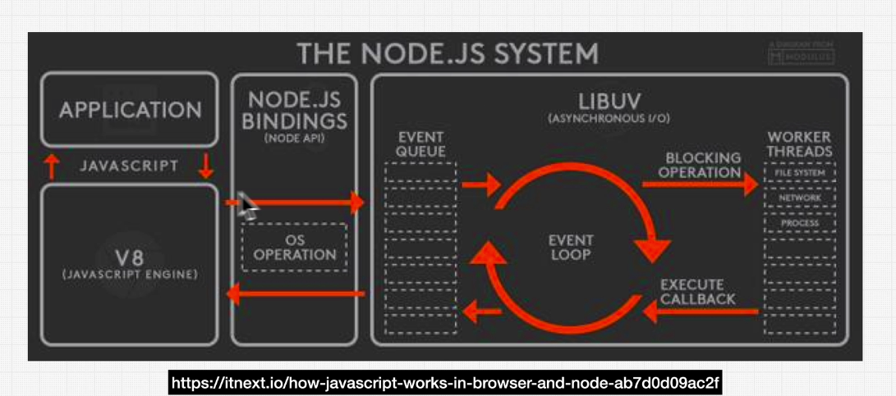

# Complete Node.js Developer by ZTM Udemy > Section 1: Introduction

**Chapters**  

* #4 Node.js - How We Got Here
* #5 Node.js Runtime
* #8 Course Projects + Code + Resources
* #9 ZTM Resources

---

## #4 Node.js - How We Got Here

**Where do we run JavaScript code?**  
We execute JavaScript code inside browsers (Chrome, Safari, Firefox etc.).  
Every browser has a built-in "JavaScript Engine" using which it can run JavaScript code.

**Are we able to run JavaScript code outside of the browser?**  
Yes  
Node.js is a "JavaScript Runtime" built on "Chrome's V8 JavaScript Engine".  
Node.js is an open source, cross-platform JavaScript runtime environment.  
Using Node.js we can run JavaScript outside of the browser.

**Refer**

- [JavaScript Engine | Wikipedia](https://en.wikipedia.org/wiki/JavaScript_engine#:~:text=A%20JavaScript%20engine%20is%20a,every%20major%20browser%20has%20one.)
- [JavaScript Engine | MDN](https://developer.mozilla.org/en-US/docs/Glossary/Engine)
- [V8](https://v8.dev/)
- [The V8 JavaScript Engine](https://nodejs.dev/en/learn/the-v8-javascript-engine/)
- [Ryan Dahl: Node JS](https://www.youtube.com/watch?v=EeYvFl7li9E)

---

## #5 Node.js Runtime

**What is Node.js?**
> Node.js is a JavaScript runtime,
> its not a programming language,
> its not a framework.

Node.js is made up of - V8 JavaScript Engine + libuv

**What is a JavaScript runtime?**  
An environment that allows to run JavaScript.

**What is libuv?**  
libuv is a multi-platform C library that provides support  
for asynchronous I/O operations based on event loop.

Things that are not part of the "V8 JavaScript Engine" like  

- file operations (read/write etc)
- database operations

and so on...  
they are handled by "libuv".

**The Node.js System**  

**Is Web browser a JavaScript runtime?**  
Yes  
A browser contains a Javascript Engine (for example Chrome's v8).  
The engine implements a Javascript runtime, which includes the call stack, heap and event loop.  
The browser also usually includes a set of APIs that augment the Javascript runtime  
and make asynchronous code execution possible.  
NodeJS also implements a Javascript runtime using Chrome's v8 engine  
as well as the libuv library (event loop and worker threads).

Here are good video lessons that breaks this all down:

- https://www.youtube.com/watch?v=4xsvn6VUTwQ
- https://www.youtube.com/watch?v=RXLS5qqkEfQ

**Refer**

- [libuv](libuv.org)
- [Node.js](https://github.com/nodejs/node)
- [Node.js Codebase](https://github.com/nodejs/node/tree/main/src)
- [How does JavaScript and JavaScript engine work in the browser and node?](https://medium.com/jspoint/how-javascript-works-in-browser-and-node-ab7d0d09ac2f)
- [Is Web browser JavaScript runtime?](https://stackoverflow.com/questions/51624548/is-web-browser-javascript-runtime#:~:text=A%20browser%20contains%20a%20Javascript,make%20asynchronous%20code%20execution%20possible.)
- [replit](https://replit.com/)

---

## #8 Course Projects + Code + Resources

**GitHub links for the cource projects**

- https://github.com/odziem/planets-project
- https://github.com/odziem/http-server
- https://github.com/odziem/express-project
- https://github.com/odziem/nasa-project
- https://github.com/odziem/performance-example
- https://github.com/odziem/security-example
- https://github.com/odziem/graphql-example
- https://github.com/odziem/multiplayer-pong

---

## #9 ZTM Resources

- https://zerotomastery.io/
- https://zerotomastery.io/cheatsheets/
- https://zerotomastery.io/blog/
- https://www.youtube.com/@ZeroToMastery
- https://www.linkedin.com/groups/12121940/
