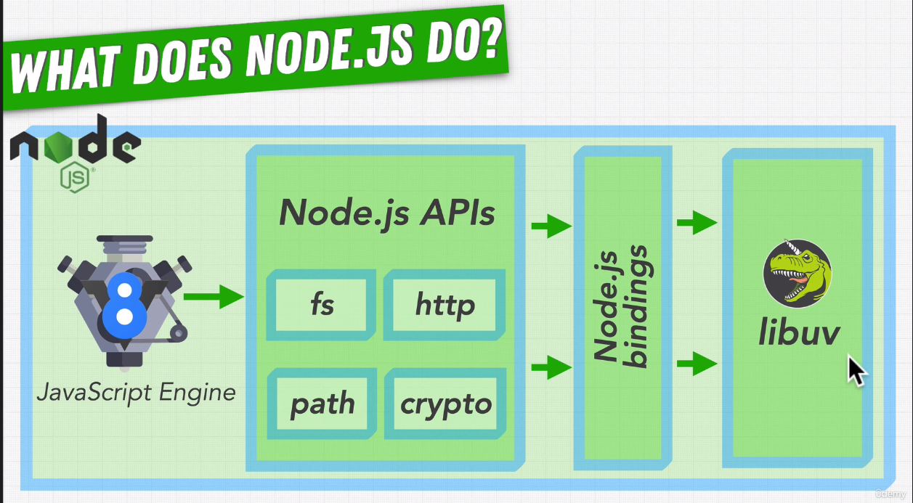
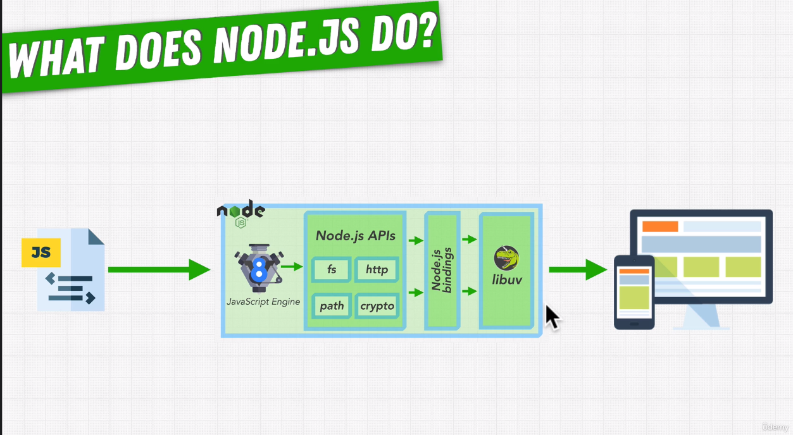
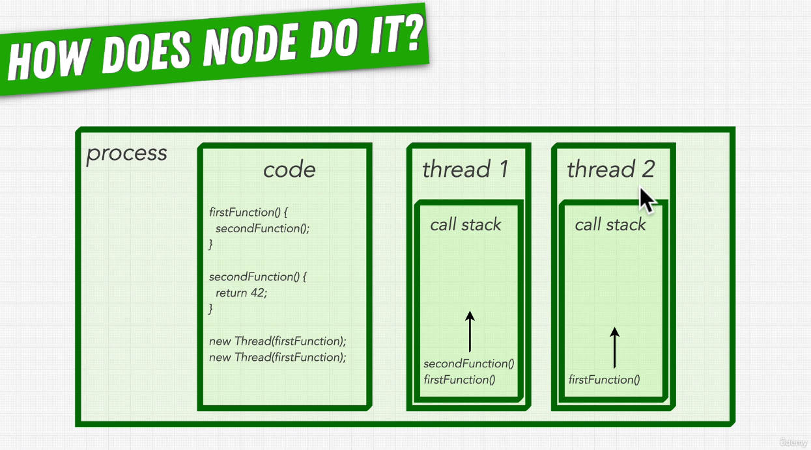
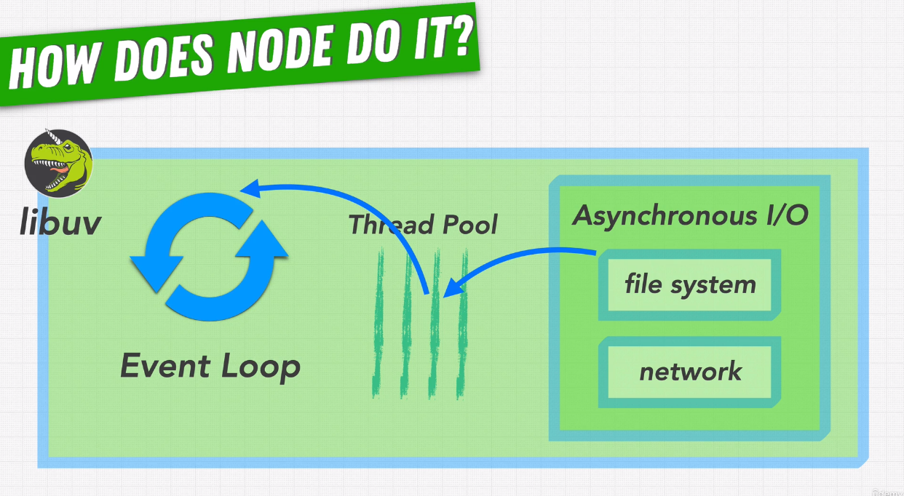
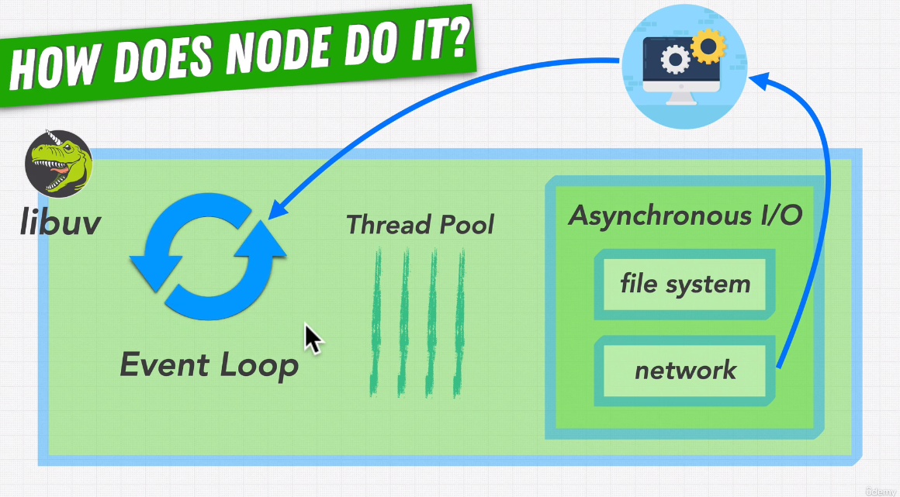
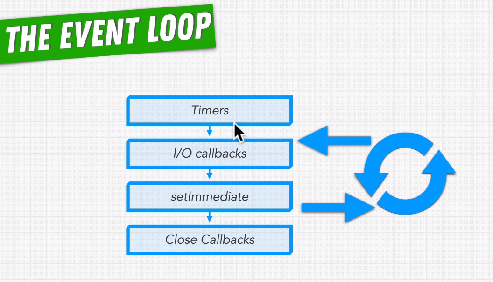
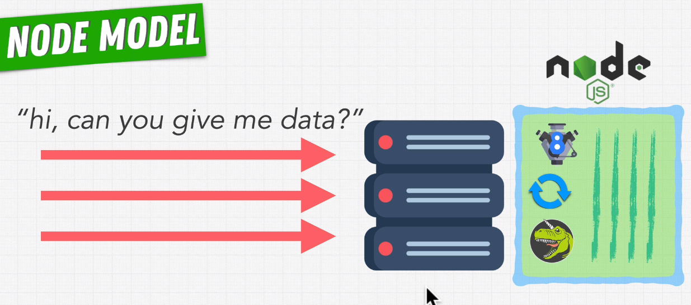
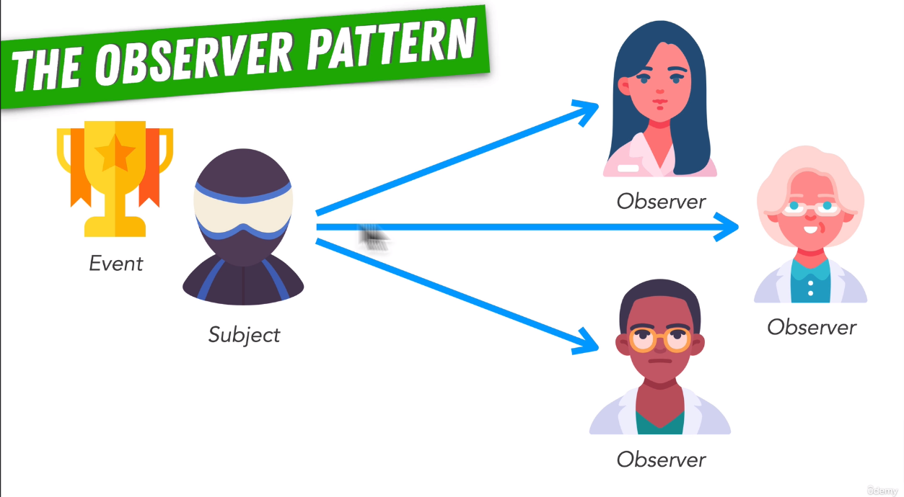

# Complete Node.js Developer by ZTM Udemy > Section 3: Node.js Fundamentals: Internals

**Chapters**  

* #21 What Node.js Includes
* #22 Node.js Internals Deep Dive
* #23 libuv Internals Deep Dive
* #24 Synchronous vs Asynchronous
* #25 Asynchronous Callbacks
* #26 Non-Blocking Input & Output
* #27 Exercise: Is JavaScript Asynchronous?
* #28 Multi-Threading, Processes & Threads
* #29 Is Node.js Multi-Threaded?
* #30 The Event Loop
* #31 Callback Queues
* #32 Phases of the Event Loop
* #33 Comparing Node.js With PHP & Python
* #34 What Is Node.js Best At?
* #35 Observer Design Pattern
* #36 The Node.js Event Emitter

---

## #21 What Node.js Includes

**What Node.js includes?**  
Node.js is made up of

- V8 JavaScript Engine
- Node.js APIs like "fs", "http", "path", "crypto" etc.
- Node.js Bindings
- libuv

**What Node.js includes**  


**What does Node.js do**  


---

## #22 Node.js Internals Deep Dive

**Node.js GitHub Repo**  
Explore Node.js GitHub Repo.

There are 2 important folders "lib" & "src".

lib  
lib has the JavaScript side of Node.js APIs.
Each of the module mentioned in the Node.js documentation lives here,
they have their corresponding files here.

src  
src is on C++ side with our low level Node.js API bindings.
Connects the JavaScript side of Node.js APIs with libuv written in C++.
src folder contains the C++ binding code.

**Example**  
Check the [open](https://nodejs.org/dist/latest-v18.x/docs/api/fs.html#fsopenpath-flags-mode-callback) function of the [File system](https://nodejs.org/dist/latest-v18.x/docs/api/fs.html) module.

Now find `fs.js` in the [lib folder](https://github.com/nodejs/node/tree/main/lib).
Click on [fs.js](https://github.com/nodejs/node/blob/main/lib/fs.js) to open it and
find the function `open`, its [here](https://github.com/nodejs/node/blob/main/lib/fs.js#L544).
Here check the `binding.open` function at the [end](https://github.com/nodejs/node/blob/main/lib/fs.js#L562).
It binds JavaScript API to the respective API in the libuv.

Now find `node_file.cc` in the [src folder](https://github.com/nodejs/node/tree/main/src).
Click on [node_file.cc](https://github.com/nodejs/node/blob/main/src/node_file.cc) to open it and
find the function `Initialize`, its [here](https://github.com/nodejs/node/blob/main/src/node_file.cc#L2609).
Here we can see that there are multiple calls of the `SetMethod`.
These `SetMethod` calls bind/associate JavaScript functions with their respective C++ functions in the libuv.

So remember we were calling `fs.open`, which will be associated to `Open` function in [node_file.cc](https://github.com/nodejs/node/blob/main/src/node_file.cc).
Check this [link](https://github.com/nodejs/node/blob/main/src/node_file.cc#L2621).
Now search `Open` function, its [here](https://github.com/nodejs/node/blob/main/src/node_file.cc#L1841).
It is the C++ implementation of the `fs.open` function.

Here we can see that there are [AsyncCall](https://github.com/nodejs/node/blob/main/src/node_file.cc#L1861) & [SyncCall](https://github.com/nodejs/node/blob/main/src/node_file.cc#L1867) to the `uv_fs_open` function in libuv.

Things that start with `uv_` prefix are references to libuv.
Search with `uv_` in this file and there are multiple occurrences of this.
These are all references to libuv.

**Refer**

- [Node.js GitHub Repo](https://github.com/nodejs/node)
- [libuv GitHub Repo](https://github.com/libuv/libuv)

---

## #23 libuv Internals Deep Dive

**What is libuv?**  
libuv is a multi-platform support library with a focus on asynchronous I/O. It was primarily developed for use by Node.js, but it's also used by Luvit, Julia, uvloop, and others.
Node.js allows us to use "libuv" by connecting to it with Node.js bindings.
Apart from Node.js, libuv is used by many others.

Check "src/win" folder for the Windows implementations.
Check "src/unix" folder for the Linux/Mac implementations.

**Refer**  

- [libuv](http://libuv.org/)
- [libuv GitHub](https://github.com/libuv/libuv)

---

## #24 Synchronous vs Asynchronous

**What is Synchronous & Asynchronous execution?**  
In programming "Synchronous" means - the code that runs line by line or in sequence.
"Asynchronous" is the opposite of "Synchronous", it means - the code that does not run line by line.

For most tasks in our programs, its possible for our computer/server to work on
the multiple tasks at the same time, when one piece of code is still executing,
our program moves onto the next piece of code, this is "Asynchronous" code execution.

Often times in your program, there will be some "Asynchronous" functions.
These "Asynchronous" functions run in the background while your JavaScript has already
moved onto the next line of code.

**Code Examples**  
Check "apps/2-second-app" application.

---

## #25 Asynchronous Callbacks

**What is Asynchronous Callbacks?**  
Callback is a function that is set to execute once an event occurs.

Some real life examples

- wake up when it is sunrise
- go to bed when it is 10 PM
- give me a callback once you reach home
- pay your bills when its due date is reached
etc.

**Code Examples**  
Check "apps/3-async-app" application.

---

## #26 Non-Blocking Input & Output

**Blocking Function**  

- Executes synchronously
- So blocks the execution of the next line until it is finished

Example
`JSON.stringify({ food: 'love' });`

**Non-Blocking Function**  

- Executes asynchronously, runs in the background
- So does not block the execution of the next line

Example
`setTimeout(function() { // do something }, 5000);`

**When to use Non-Blocking Function?**  
Operations/processes which are dependent on third party/external services
or other devices like hard disk, camera etc. take longer to finish.
We should handle such operations/processes using Non-Blocking Functions
so that Node.js can continue rest of the operations without blocking the main thread.

Some of the use cases are:

- file operations
- database operations
- using 3rd party services via API calls
- any processes that are long running and can be put into the background
- using camera to take pictures/videos or scan QR code
etc.

---

## #27 Exercise: Is JavaScript Asynchronous?

**Is JavaScript Asynchronous?**  
JavaScript itself is a Synchronous language.  
It executes code line by line, in sequence, synchronously.

But it can be manipulated to behave like an Asynchronous language.  
We can write Asynchronous code, where we are able to execute  
callback function in the future when some event occurs.

Browser and Node.js allows us to write Asynchronous code.

Asynchronous code examples  
`setTimeout`

NOTE: Promise/fetch are part of JavaScript since ES6, using it we can write Asynchrounous code.

---

## #28 Multi-Threading, Processes & Threads

**Processes**  
Processes are containers, that contain your Code.
This Code lives in the memory of the Process.

**Processes & Threads**  
Processes also contain one or more Threads.
Threads share memory and code but not call stacks.
Threads execute side-by-side and independently, they don't interfere with each other.

So using multiple threads, processes can execute their code asynchronously.

When a CPU has multiple chores, each chore can execute one thread.
So if a CPU has 4 chores, then it can execute 4 threads simultaneously.



> JavaScript is a single threaded programming language.

In Node.js we have one main thread which executes JavaScript and Event Loop.  
Other threads are managed by the Event Loop, as a developer we don't need to worry about them.

---

## #29 Is Node.js Multi-Threaded?

**The Main Thread**  
JavaScript is a single threaded programming language.
So if it is not threads then how does Node.js execute code Asynchronously.

In Node.js we have one main thread which runs

- the V8 JavaScript engine
- Node.js APIs
- libuv (Event Loop + Thread Pool)

**libuv & Thread Pool**  
libuv handles Asynchronous I/O

- file system operations
- network operations
etc.

Inside libuv we have thread pool/collection of threads.
libuv is written in C/C++ which does have threads.

For example, for file system operations which use the Thread Pool,  
libuv would send the work to one of the threads,  
this thread then runs independently of all the other threads,  
this would happen in the background,  
and when the operation completes the Event Loop will get notified of the result,  
and then its corresponding callback is pushed into the Callback Queue/Microtask Queue,  
at the end it is picked by the Event Loop for execution.



**libuv & OS/Kernel**  

Note that, not all the asynchronous functions are executed in the thread pool.  
Wherever possible libuv uses the operating system kernel directly instead of threads.



**Summary of JavaScript Code Execution**  

JavaScript Application  
-> Synchronous Code  
    - Main Thread takes care of it.  
    - DONE  
-> Asynchronous Code  
    - libuv takes care of it.  
    - Offloads to one the threads in the Thread Pool OR OS Kernel (wherever possible).  
    - Runs in the background.  
    - Once done, corresponding callback is pushed into the Callback Queue/Microtask Queue.  
    - At the end this callback is picked by Event Loop for execution.  
    - DONE

**The Event Loop**  
Using Event Loop code libuv runs Asynchronous function and  
when it is finished it executes the corresponding callback function.

In Node.js whenever we call an Asynchronous function from JavaScript  
it is put on the Event Loop.

JavaScript executes on the main thread and any Asynchronous functions are put on the Event Loop.  

As a Node.js developer we never have to worry about managing multiple threads.  
It allows developer to focus more on the application, it also simplifies how you write code.

---

## #30 The Event Loop

**What is Event Loop?**  
The Event Loop is the most important part of the Node.js runtime.
It is responsible for handling all the callback functions in your program.
These callback functions allows Node.js to execute code asynchronously.

Its the Event Loop that allows Node.js program to do multiple things all at once
even though JavaScript is a single threaded language.

Psuedocode for the Event Loop looks like below:

```
// while Node.js code is running
while (!shouldExit) {
    // process all the events, execute corresponding callback when an event occurs
    processEvents();
}
```

The Event Loop is a piece of code in libuv that processes Asynchronous events.

Pseudocode for the Event Loop.

```
// While application is on OR execution is not over.
while (appIsOn) {
    // Check if Micro Task Queue is non empty.
    while (microTaskQueue) {
        // Process callbacks ready for execution from the Micro Task Queue OR the Priority Queue.
        // Set microTaskQueue = false when there are no more callbacks left.
    }

    // Check if Task Queue is non empty.
    while (taskQueue) {
        // Process callbacks ready for execution from the Task Queue OR the Callback Queue.
        // Set microTaskQueue = false when there are no more callbacks left.
    }
}
```

---

## #31 Callback Queues

**What is a Callback Queue?**  
When ready for execution, callbacks are put on the callback queue.

Callback queue keeps track of which callbacks are ready to be executed.

Callback queue is a FIFO queue, that means the functions added first will be executed first.

Other terms for the callback queue are "Event Queue"/"Message Queue".

**Callback Queue (FIFO)**  


---

## #32 Phases of the Event Loop

**4 Main Phases of the Event Loop**  
There is no one callback queue, there are multiple callback queues.
Each one handles a different phase of the Event Loop.

There are 4 main phases of the Event Loop:

- Timers
- I/O Callbacks
- setImmediate
- Close Callbacks


Each of these phases is responsible for a different category of operations that
the Event Loop processes.
Each of these phases has their own queue of callbacks that are executed during that phase.

There are 3 types of timers that we have in Node.js.

- `setTimeout`
- `setInterval`
- `setImmediate`

Event Loop goes through each of these phases one by one in its iteration and
executes callbacks for all of them.



**Refer**  
[The Node.js Event Loop, Timers, and `process.nextTick()`](https://nodejs.org/en/docs/guides/event-loop-timers-and-nexttick/)

---

## #33 Comparing Node.js With PHP & Python

**Node.js Vs PHP/Python**  
PHP & Python are high level "single threaded" languages.
PHP & Python need a web server, e.g., Apache/NGINX to handle multiple client requests.

Each request to Apache is blocking, it is handled by its own thread.
Each client talking to our server will get its own thread.
This means our server will need a lot of threads with a lot of resources being used by those threads.


So building a site/app that serves millions of users is quite difficult and expensive.
Server will get crash pretty quickly if it gets a lot of traffick.

Node.js became popular because of its non-blocking I/O.

Node.js doesn't need a server like Apache to handle multiple client requests.



**Refer**  
[Node.JS VS PHP  -  in a nutshell](https://www.hi5.team/blog/node-js-vs-php-in-a-nutshell)

---

## #34 What Is Node.js Best At?

**Node.js is best at creating Web Servers**  

Node.js works really well when your main performance problem is input/output
rather than heavy calculations.
If our code blocks the JavaScript or uses CPU heavily then our Event Loop will get stuck,
and then Node.js won't be able to manage the other tasks happening side by side efficiently.
On the other hand Node.js is really good at serving data for I/O heavy applications.

Node.js is not good at

- audio/video processing
- machine learning

---

## #35 Observer Design Pattern

**About Observer Design Pattern?**  
We make use of "Observer Design Pattern" to deal with Asynchronous events.

There are two entities involved:  

- Subject
- Observers

**Example**  
Imagine a celebrity, for example "Keanu Reeves".  
He is a "Subject".

He has millions of fans who love to "observe" him.  
These are "Observers".  
Just like they are following him on Twitter.

Observers are subscribed to get updates from the Subject.  

Now when Keanu Reeves tweets a post about his latest movie or an event,  
all his followers get notified, they get the updates.

Node.js is an asynchronous event-driven JavaScript runtime.  

Here event-driven means - a "Subject" can emit one or more events and  
its "Observers" are notified about it.



**Refer**  
[About Node.js](https://nodejs.org/en/about/)

---

## #36 The Node.js Event Emitter

**Events Module**  
Node.js has built-in module that helps us to work with events - "Events" module.
[Events](https://nodejs.org/api/events.html#events_events)

When the `EventEmitter` object emits an event, all of the functions attached to that specific event are
called synchronously. Any values returned by the called listeners are ignored and discarded.

The `EventEmitter` object has two methods  

- `on()` method is used to register listeners (callback functions)
- `emit()` method is used to trigger the event

**Code Examples**  
Check "apps/4-event-app" application.

**Refer**  

- [Events](https://nodejs.org/api/events.html#events_events)
- [Process events](https://nodejs.org/api/process.html#process-events)
