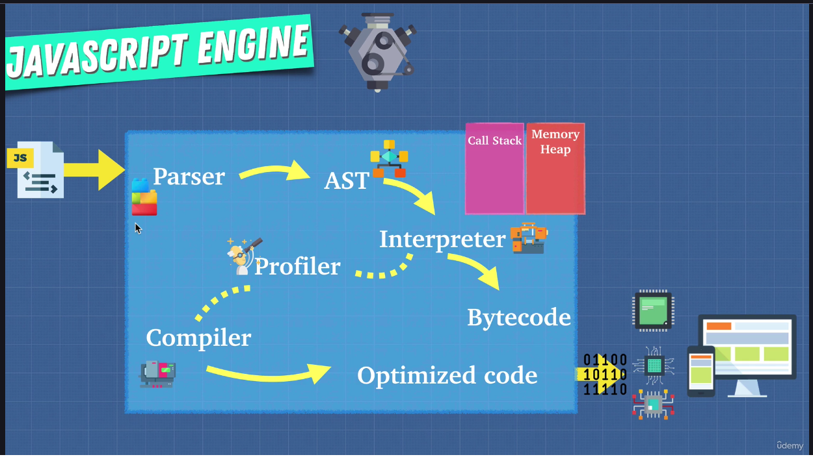
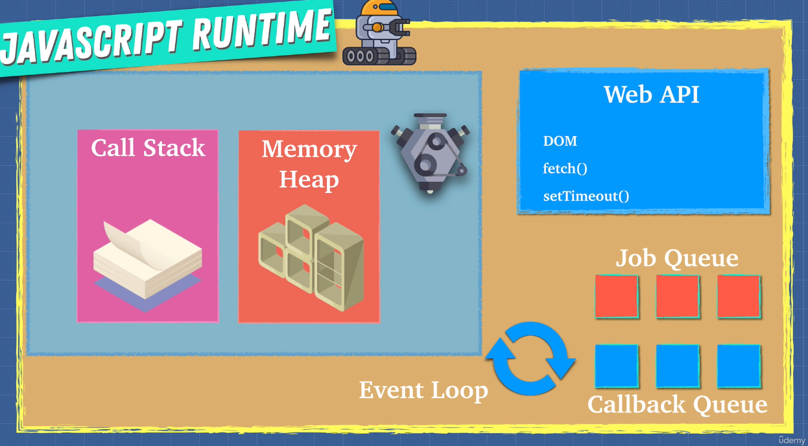

# Appendix: How JavaScript Works

**Chapters**  

* #353 JavaScript Engine
* #355 Inside the JavaScript Engine
* #356 JavaScript Engine for all
* #357 Interpreters and Compilers
* #360 Writing Optimized Code
* #361 WebAssembly
* #362 Call Stack & Memory Heap
* #363 Stack Overflow
* #364 Garbage Collection
* #365 Memory Leaks
* #366 Single Threaded
* #367 Issue with Single Thread
* #368 JavaScript Runtime
* #369 Node.js

---

## #353 JavaScript Engine

**JavaScript Engine OR ECMAScript Engine**  

Using JavaScript Engine computer can understand JavaScript code.
OR
Using JavaScript Engine we can execute JavaScript code.

Examples of JavaScript Engine
- V8 for Google Chrome
- SpiderMonkey for Mozilla Firefox
- JavaScriptCore for Apple Safari

**Who created the first JavaScript Engine?**  

The first JavaScript engine, named SpiderMonkey, was created by Brendan Eich while he was working at Netscape Communications Corporation in 1995. This engine was an interpreter for the JavaScript language (initially called Mocha, then LiveScript) within the Netscape Navigator web browser.  

Brendan Eich designed JavaScript in just ten days to add dynamic and interactive features to static HTML web pages. The language and its original SpiderMonkey engine were written in the C programming language.  

The SpiderMonkey engine is still in use today, primarily in the Mozilla Firefox browser and other Mozilla-based applications. Modern JavaScript engines, including SpiderMonkey, are much more advanced and use just-in-time (JIT) compilation for improved performance compared to the original interpreter.

---

## #355 Inside the JavaScript Engine

**Inside JavaScript Engine**



```
JavaScript Code ---- Input ----> JavaScript Engine
-> Parsing
-> AST
-> Interpreter -> Bytecode
AND
-> Interpreter -> Profiler -> Compiler -> Optimized Code
```

When JavaScript Code is given as input to JavaScript Engine:
* First it does lexical analysis, which breaks the code into tokens to identify their meanings so that we know what the code is trying to do.
* These tokens form an AST (Abstract Syntax Tree). Try [AST Explorer](https://astexplorer.net/) to get an idea.
* Then comes Interpreter.

**Reference**

* [AST Explorer](https://astexplorer.net/)

---

## #356 JavaScript Engine for all

Since everybody can create their own JavaScript Engine,  
it will just be total chaos if there are no standards followed.

Which is why ECMAScript was created to standardize JavaScript Engines.

ECMAScript tells people, here is the standard way to do things in JavaScript,  
it decides how the JavaScript language should be standardized.  
ECMAScript tells JavaScript Engine creators this is how JavaScript should work,  
but internally, how you build the engine is up to you as long as it conforms  
to the standards.

---

## #357 Interpreters and Compilers

In programming, there are two ways to translate programming language into  
machine language.

* Interpreter
* Compiler

**Interpreter**

We read & translate the code into machine language line by line on the fly.

Pros  
Interpreters are quick to get up and running.
That is why JavaScript used Interpreters at the beginning.

Cons  
Running the same code over and over (for example calling a function from a loop),  
even though it gives the same result, it becomes really slow.  
It does not save the result it Interpretes again and again.  


**Compiler**

Compiler, like an Interpreter, doesn't translate line by line on the fly.
But Compiler, works ahead of time to translate whole file into the language  
that machine can understand.

Pros  
Compiler performs optimizations like it will not repeat the processing of the same code/function.  
It kinda stores the results and uses it directly instead of processing the same code again and again.  
Code execution is faster compared to Interpreter because of code optimizations.

Cons  
Takes a little bit longer to get up and running.
It takes little bit more time to start up because it has to go through that compilation step.

**JIT Compiler**

JIT (Just In-time Compiler) = Compiler + Interpreter
JIT Compiler is the combination of Compiler & Interpreter.


JavaScript Code ---- Input ----> JavaScript Engine
-> Parsing
-> AST
-> Interpreter -> Bytecode
AND
-> Interpreter -> Profiler -> Compiler -> Optimized Code

Bytecode is code that is not as low level as machine code,  
but it is code that is able to be interpreted by the JavaScript Engine  
in order to run JavaScript apps.

This is the first step in executing JavaScript code.

Now there is something called "Profiler"/"Monitor",  
it checks/monitors/watches our code as it runs.  
It makes notes on how we can optimize this code.  

And using this Profiler as the code is running through our Interpreter,  
which tells our browser what to do.  
If the same lines of code run a few times,  
we actually pass off some of this code to the Compiler/JIT Compiler,  
because as the code is running, the Interpreter is going to say,  
hey, here is some code for you to optimize, passes it off to the compiler  
and the compiler as the application is running, takes a code and  
compiles it or modifies it, so it does what you ask it to,  
but trying to make optimizations so it runs faster.  

And it then replaces the sections where it could be improved of the bytecode  
with optimized machine code.  
So that optimized code is then used from that point on instead of the slower bytecode,  
so it mixes and matches things, and it constantly runs through this loop.  

This means that the execution speed of the JavaScript code that we entered into  
the JavaScript Engine is going to improve gradually,  
because the Profiler and the Compiler are constantly making updates and changes  
to our Bytecode in order to be as efficient as possible.

So Interpreter allows us to run the code right away,  
and the Compiler and Profiler allows us to optimize  
this code as we're running.  
That's where the name comes from - JIT Compiler (Just In-time Compiler).

**Is JavaScript an interpreted language?**

Earlier versions of JavaScript were interpreted,  
but then JavaScript Engines gradually changed their implementations of  
executing JavaScript code.  
Modern JavaScript Engines come with JIT Compilers to execute JavaScript code.  
JIT Compiler is the combination of Interpreter & Compiler.  

---

## #360 Writing Optimized Code

In order to help JavaScript Engine, you need to be careful with the following:  

* `eval()` - use of `eval()` function.
* arguments - function arguments and how to use parameter destructuring to avoid using arguments
* for in - looping over objects using for in
* with
* delete

Explore about:

* Hidden Classes
* Inline Caching

**References**

* [Managing Arguments](https://github.com/petkaantonov/bluebird/wiki/Optimization-killers#3-managing-arguments)
* [Javascript Hidden Classes and Inline Caching in V8](https://richardartoul.github.io/jekyll/update/2015/04/26/hidden-classes.html)

---

## #361 WebAssembly

**Why not just use machine code from the beginning?**

Compiling the code ahead of time or compiling the code in the browser was not feasible at all,  
because back in the day that was really really slow.  

All the browsers will have to agree on the same executable format to run JavaScript.  

Browsers have different ways of doing things, there is no real standard.  

WebAssembly  
We now have the standard binary executable format called web assembly.

---

## #362 Call Stack & Memory Heap

**Memory Heap**  
A place to allocate, use & release memory.  
Takes care of memory.  

**Call Stack**
A place to keep track of where we are in the code so that we can run the code in order.  
Takes care of execution.  

---

## #363 Stack Overflow

```JavaScript

function blowCallStack() {
    blowCallStack();
}

blowCallStack();

```

It gives the below error in console:  
`Uncaught RangeError: Maximum call stack size exceeded`

---

## #364 Garbage Collection

JavaScript is a Garbage Collected language, means it automatically does the job of  
garbage collection or freeing up memory which is not in use.

Garbage collector frees up memory on the heap and prevents memory leaks.

So how does garbage collection actually work in JavaScript?  
Well, it uses something called "mark and sweep algorithm".  
We mark what we need and sweep what we don't.  

---

## #365 Memory Leaks

```JavaScript

// Example #1

let numbers = [];

// Infinite loop to add elements in the array above.
for (let i = 1; i > 0; i++) {
    numbers.push(i);
}

// Example #2
setInterval(() => {
    // referencing variables, objects etc.
    // these are never going to be Garbage Collected until we clear this interval.
}, 1000);
```

Guidelines to avoid Memory Leaks:  

* Avoid too many Global variables
* Event listeners - remove them when they are not in use any more.
* `setInterval` - variables, objects used inside the callback are never going to be Garbage Collected if we have not cleared the interval.

**References**

* [Garbage Collection in Redux Applications](https://developers.soundcloud.com/blog/garbage-collection-in-redux-applications)
* [Window: setInterval() method](https://developer.mozilla.org/en-US/docs/Web/API/Window/setInterval)

---

## #366 Single Threaded

JavaScript is a Single Threaded programming language.

Well, being single threaded means that only one set of instructions is executed at a time.  
It's not doing multiple things.  

And the biggest way to check that a language is single threaded is, well,  
it has only one call stack.  

This one call stack allows us to run code one at a time.  
We're never running functions in parallel.  

The call stack keeps growing as we push new functions on the stack and  
then we pop them one at a time.

And because of this JavaScript is Synchronous.

---

## #367 Issue with Single Thread

**What problems do you see with Synchronous code?**

Since JavaScript is Single Threaded & Synchronous,  
it becomes really difficult if we have a long running task.  

---

## #368 JavaScript Runtime

JavaScript Runtime has the following components:

* V8 JavaScript Engine
    * Call Stack
    * Memory Heap
* Web APIs
* Event Loop
* Callback Queues (Task Queue, Microtask/Priority Queue etc.)

**Web APIs**  
The Web APIs comes with the browser, Chrome, Microsoft Edge, Safari, Firefox.
Web APIs can do variety of things like - 

* send HTTP requests - using `fetch()` for example.
* listen to DOM events
* use timers - `setTimeout`, `setInterval` etc.
* caching or database storage on the browser, `indexedDB` for example.
* alerting - using `alert()`

All the Web APIs are available under the `window` global object.

**JavaScript Runtime**  



**Code Example**  

```JavaScript
function printHello() {
    console.log('Hello from baz');
}

function baz() {
    setTimeout(printHello, 3000);
}

function bar() {
    baz();
}

function foo() {
    bar();
}

foo();
```

**References**  

* [loupe - JavaScript Runtime Playground](http://latentflip.com/loupe/?code=ZnVuY3Rpb24gcHJpbnRIZWxsbygpIHsNCiAgICBjb25zb2xlLmxvZygnSGVsbG8gZnJvbSBiYXonKTsNCn0NCg0KZnVuY3Rpb24gYmF6KCkgew0KICAgIHNldFRpbWVvdXQocHJpbnRIZWxsbywgMzAwMCk7DQp9DQoNCmZ1bmN0aW9uIGJhcigpIHsNCiAgICBiYXooKTsNCn0NCg0KZnVuY3Rpb24gZm9vKCkgew0KICAgIGJhcigpOw0KfQ0KDQpmb28oKTs%3D!!!PGJ1dHRvbj5DbGljayBtZSE8L2J1dHRvbj4%3D)

---

## #369 Node.js

Node.js is a free, open-source, cross-platform JavaScript runtime environment  
that lets developers create servers, web apps, command line tools and scripts.
