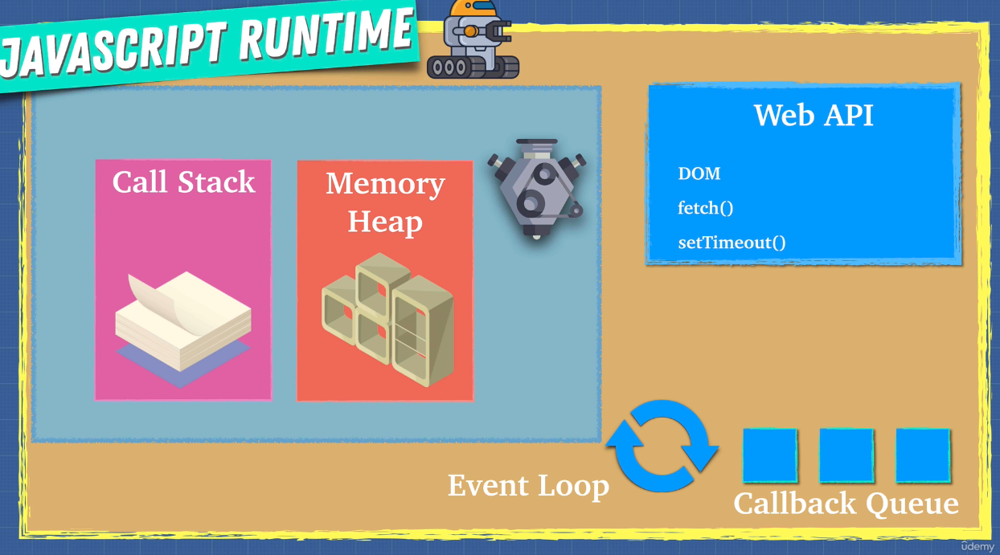
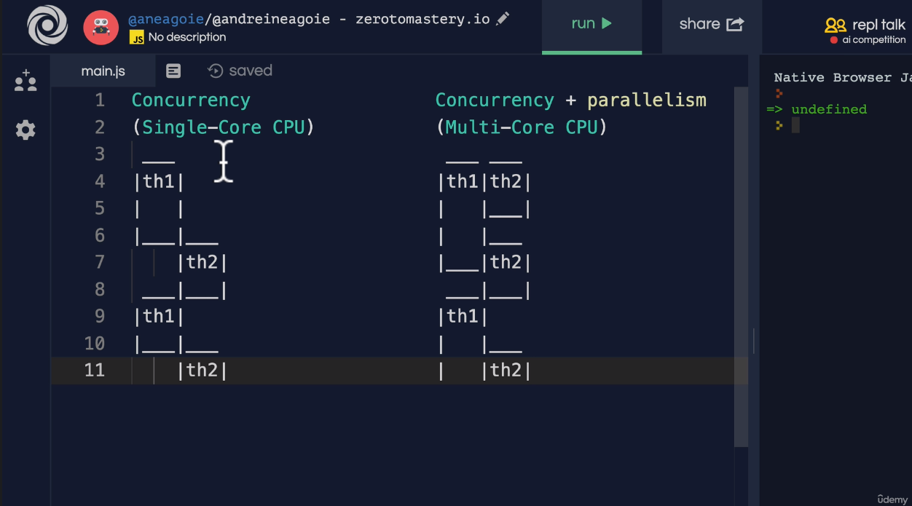
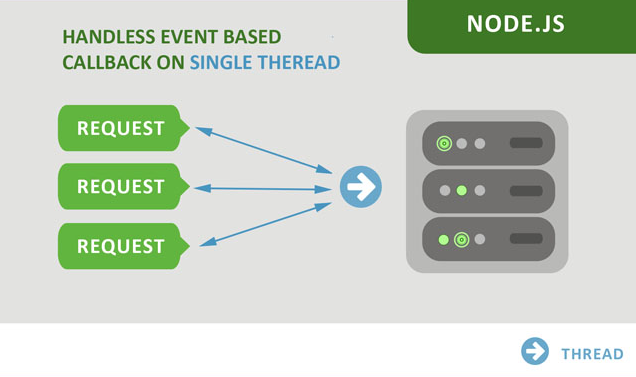
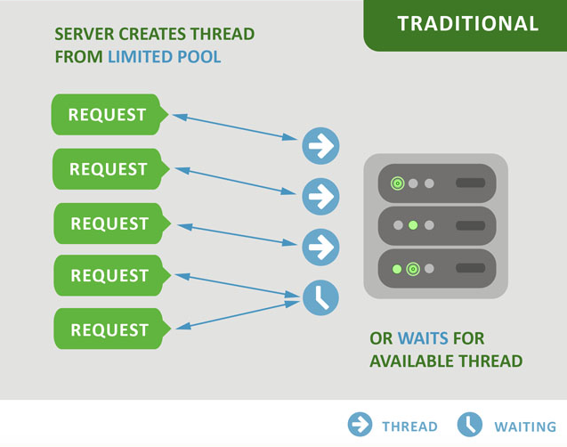
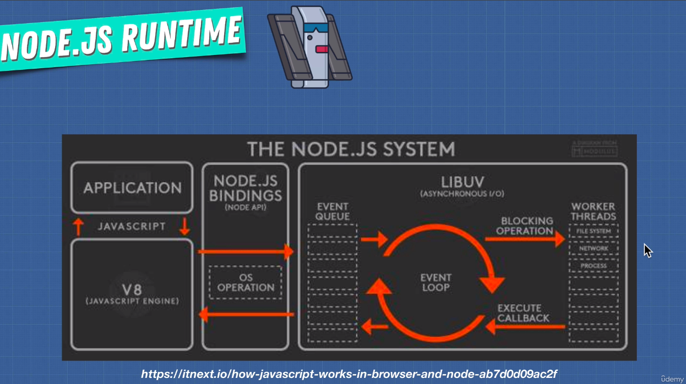

# Complete Node.js Developer by ZTM Udemy > Appendix: Asynchronous JavaScript

**Chapters**  

* #372 Section Overview
* #373 Promises
* #374 ES8 - `async`, `await`
* #375 ES9 (ES2018)
* #376 ES9 (ES2018) - Async
* #377 Job Queue
* #378 Parallel, Sequence & Race
* #379 ES2020: allSettled()
* #380 Threads, Concurrency & Parallelism

---

## #372 Section Overview

**Asynchronous JavaScript Topics**  

- Web APIs
- Async/Await
- Callbacks
- Microtask Queue (Job Queue)
- Task Queue (Callback Queue)
- Promises
- Event Loop

**JavaScript Runtime**  


Once JavaScript engine sees something that is asynchronous or something that is  
timeout which is part of the Web API, we send it over to the Web API.  

Then the Web API is going to do something for us in the background,  
when it is done it will add callback/listener function in the "Callback Queue".  

And then the "Event Loop" checks if the "Callstack" is empty and  
our entire JavaScript file has been read once.  

If the "Callstack" is empty it pushes the "Callback" into it.  
So the "Event Loop" monitors the "Callstack" and the "Callback Queue".  

Once Callstack is empty and entire JavaScript file is read once,  
it is time to check and execute callbacks/jobs available in the  
Callback/Task Queue & Microtask/Priority Queue.  

Psuedocode for the Event Loop looks like below:  

```
// while Node.js code is running
while (!shouldExit) {
    // process all the events, execute corresponding callback when an event occurs
    // it will push callbacks into "Callback Queue"
    processEvents();

    if (emptyCallStack && !emptyCallbackQueue) {
        // executes callbacks in FIFO order from the "Callback Queue"
        executeCallback();
    }
}
```

The Event Loop is a piece of code in libuv that processes Asynchronous events.

**Refer**  
[replit](https://replit.com/)

---

## #373 Promises

https://developer.mozilla.org/en-US/docs/Web/JavaScript/Reference/Global_Objects/Promise
https://developer.mozilla.org/en-US/docs/Web/JavaScript/Reference/Global_Objects/Promise/Promise

**About Promises**  
Promises are a new feature in JavaScript as of ES6.
Promises are part of JavaScript and they provide "native" way of writing/handling
Asynchronous code in JavaScript.

> A promise is an object that may produce
> a single value some time in the future.
> Either a resolved value,
> or a reason that it is not resolved (rejected).

A promise can be in any one of the following stats:

- Pending
- Resolved/Fulfilled
- Rejected

**Promises Vs Callbacks**  
Prefer Promises over Callbacks.

Nested callbacks make the code hard to read and maintain.  
Some examples of the nested callbacks are as below:  

"Callback pyramid of doom"  

Example #1

```JavaScript
grabTweets('twitter/johnwick', (error, johnWickTweets) => {
    if (error) {
        throw Error;
    }

    displayTweets(johnWickTweets);

    grabTweets('twitter/ironman', (error, ironManTweets) => {
        if (error) {
            throw Error;
        }

        displayTweets(ironManTweets);

        grabTweets('twitter/thor', (error, thorTweets) => {
            if (error) {
                throw Error;
            }

            displayTweets(thorTweets);
        });
    });
});
```

Example #2

```JavaScript
movePlayer(100, 'Left', function() {
    movePlayer(400, 'Left', function() {
        movePlayer(10, 'Right', function() {
            movePlayer(330, 'Left', function() {
                // some code...
            });
        });
    });
});
```

Using Promises we can rewrite the above examples as follows:

Example #2

```JavaScript
movePlayer(100, 'Left')
    .then(() => movePlayer(400, 'Left'))
    .then(() => movePlayer(10, 'Right'))
    .then(() => movePlayer(330, 'Left'));
```

Promises are very useful in writing Asynchronous code.

`fetch()` function returns a Promise.

NOTE:
Promises execute when we attach "then()" or prefix it with "await".

An Asynchronous function is a Promise which needs to be resolved/rejected.
So when we call such a function it returns a Promise.
We need to wait for the results, so we put await in front of it to get results.

OR the other way is once Promise is fulfilled or rejected then we take next steps.
So we attach "then()" and provide a callback to perform next steps.

**Code Examples**  
Check "apps/5-resolved-rejected-promises" application.  
Check "apps/6-multiple-promises" application.

**Refer**  
[SWAPI - Star Wars API Integrations](https://pipedream.com/apps/swapi)

---

## #374 ES8 - `async`, `await`

**About `async`, `await`**  
`async`, `await` are part of ES8 and they are built on top of Promises.

An async function returns a Promise.

`async`, `await` makes the Asynchronous code look like the Synchronous code,
which is even more readable.

`async` `await` code are just Promises underneath the hood, they are just syntactic sugar.  
We call the syntactic sugar something that still does the same thing,  
but it's just different syntax to make it look prettier.

Examples

```JavaScript
// Using the Promise
movePlayer(100, 'Left')
    .then(() => movePlayer(400, 'Left'))
    .then(() => movePlayer(10, 'Right'))
    .then(() => movePlayer(330, 'Left'));

// Using aync await
async function playerStart() {
    await movePlayer(100, 'Left'); // pause
    await movePlayer(400, 'Left'); // pause
    await movePlayer(10, 'Right'); // pause
    await movePlayer(330, 'Left'); // pause
}

playerStart(); // this will execute asynchronously
// await playerStart(); // this will execute synchronously, we are waiting for playerStart() to complete.


// Using the Promise
fetch('https://jsonplaceholder.typicode.com/users')
    .then((response) => response.json())
    .then((jsonResponse) => console.log(jsonResponse));

// Using aync await
async function fetchUsers() {
    const response = await fetch('https://jsonplaceholder.typicode.com/users');
    const jsonResponse = await response.json();
    console.log(jsonResponse);
}

fetchUsers(); // this will execute asynchronously
// await fetchUsers(); // this will execute synchronously, we are waiting for fetchUsers() to complete.
```

**Code Examples**  
Check "apps/7-async-await" application.

---

## #375 ES9 (ES2018)

**Object Spread Operator**  
[Spread syntax (...)](https://developer.mozilla.org/en-US/docs/Web/JavaScript/Reference/Operators/Spread_syntax)

**Code Examples**  
Check "8-object-spread-operator" application.

---

## #376 ES9 (ES2018) - Async

Using `finally` in the Promises.

Using `for await` to loop through the Promises.

**Code Examples**  
Check "apps/9-promise-finally" application.  
Check "apps/7-async-await" application.  

---

## #377 Job Queue

**Microtask Queue Vs Task Queue**  
Microtask Queue (Job Queue)
Callbacks in the Asynchronous code which is part of the JavaScript (like Promises)
are put on the Microtask Queue/Job Queue.

Task Queue (Callback Queue)
Callbacks in the Asynchronous code which is not part of the JavaScript (like setTimeout)
are put on the Task Queue/Callback Queue.

setTimeout is a part of the Web API.

> The Microtask Queue/Job Queue has higher priority over the Task Queue/Callback Queue.
> So the Event Loop checks and executes all the callbacks from the Microtask Queue/Job Queue
> first and then the Task Queue/Callback Queue.


**Code Examples**  
Check "apps/3-async-app" application.

---

## #378 Parallel, Sequence & Race

**3 ways to execute Promises**  

Promises can be executed in 3 ways  

- Parallel
- Sequencial
- Race

Parallel
`Promise.all()`
Promises execute in parallel to each other.
Callback will be executed once all of them finishes their execution.

Sequencial
Promises execute in sequence, one after the other.
Callback will be executed once all of them finishes their execution.

Race
`Promise.race()`
Technically all Promises will start at the same time, they run in parallel.
Hence there is a race, the one which finishes first is a winner.
As soon as one of the Promises finishes first, Callback will be executed.

NOTE: Is there a limit for how many promises can run in parallel?

**When to use what?**  
If we want to execute all of the promises regardless of their order of execution
then we should use Parallel method.

If we want to execute all of the promises in a specific order
then we should use Sequence method.

If we want to execute all of the promises but move forward with the one
which finishes first then we should use Race method.

**Parallel, Sequence, Race which is fastest?**  

Lets take an example,
assume there are 3 promises - first, second, third.
first takes 10 milli seconds, second takes 20 milli seconds & third takes 30 milli seconds
to complete.

When using Race, the first promise will be completed first,
so it takes 10 milli seconds.

When using Parallel, all promises will execute in parallel,
it will take at least 30 milli seconds.

When using Sequencial, all promises will execute one after the other,
so it will take at least 10 + 20 + 30 = 60 milli seconds.

Race > Parallel > Sequence

**Code Examples**  
Check "apps/10-promises-parallel" application.
Check "apps/11-promises-race" application.
Check "apps/12-promises-sequence" application.

---

## #379 ES2020: allSettled()

**`all()` vs `allSettled()`**  
`allSettled()` in promises is part of ES2020.

When all the promises inside `Promise.all` are resolved, it executes the callback in `then`.
If anyone of them fails then it executes the callback in `catch`.

When all the promises inside `Promise.allSettled` are settled, it executes the callback in `then`.

When promise finishes its execution it can be in either Fulfilled/Resolved or Rejected status,
and we say that the promise is settled now, it is no more in Pending status.
When a promise is settled, it can be in either Fulfilled or Rejected status.

`allSettled()` executes all the promises regardless of their status,
it gives chance to execute all of the promises.
Whereas `all()` finishes (short circuits) as soon as one of the promises failed to resolve.

`allSettled()` returns an array of settled promises.
When all of the promises resolved `all()` returns an array of result of the resolved promises,
if one or more promises are rejected then `all()` executes catch block to handle failure
or throws an exception if catch block is not present.

**Code Examples**  
Check "apps/13-allSettled" application.

---

## #380 Threads, Concurrency & Parallelism

**Threads, Concurrency & Parallelism**  
A web worker is a JavaScript program running on a different thread in parallel to our main thread.

Concurrency in single core CPU  
Since there is a single CPU, it can only execute one thread at a time.
So CPU switches between multiple threads.

Concurrency & Parallelism in multi core CPU  
Since there are multiple CPUs, it can execute multiple threads simultaneously or in parallel.









**Refer**  

- [Scaling Node.js Applications](https://www.freecodecamp.org/news/scaling-node-js-applications-8492bd8afadc/)
- [Child processes](https://nodejs.org/api/child_process.html)
