# Complete Node.js Developer by ZTM Udemy

## #4 Node.js - How We Got Here

**Where do we run JavaScript code?**  
We execute JavaScript code inside browsers (Chrome, Safari, Firefox etc.).
Every browser has a built-in "JavaScript Engine" using which it can run JavaScript code.

**Are we able to run JavaScript code outside of the browser?**  
Yes
Node.js is a "JavaScript Runtime" built on "Chrome's V8 JavaScript Engine".
Node.js is an open source, cross-platform JavaScript runtime environment.
Using Node.js we can run JavaScript outside of the browser.

**Refer**

- [JavaScript Engine | Wikipedia](https://en.wikipedia.org/wiki/JavaScript_engine#:~:text=A%20JavaScript%20engine%20is%20a,every%20major%20browser%20has%20one.)
- [JavaScript Engine | MDN](https://developer.mozilla.org/en-US/docs/Glossary/Engine)
- [V8](https://v8.dev/)
- [The V8 JavaScript Engine](https://nodejs.dev/en/learn/the-v8-javascript-engine/)
- [Ryan Dahl: Node JS](https://www.youtube.com/watch?v=EeYvFl7li9E)

---

## #5 Node.js Runtime

**What is Node.js?**
> Node.js is a JavaScript runtime,
> its not a programming language,
> its not a framework.

Node.js is made up of - V8 JavaScript Engine + libuv

**What is a JavaScript runtime?**  
An environment that allows to run JavaScript.

**What is libuv?**  
libuv is a multi-platform C library that provides support
for asynchronous I/O operations based on event loops.

Things that are not part of the "V8 JavaScript Engine" like

- file operations (read/write etc)
- database operations
and so on...
they are handled by "libuv".

**Is Web browser a JavaScript runtime?**  
Yes
A browser contains a Javascript Engine (for example Chrome's v8).
The engine implements a Javascript runtime, which includes the call stack,
heap and event loop. The browser also usually includes a set of APIs
that augment the Javascript runtime and make asynchronous code execution possible.
NodeJS also implements a Javascript runtime using Chrome's v8 engine
as well as the libuv library (event loop and worker threads).

Here are good video lessons that breaks this all down:

- https://www.youtube.com/watch?v=4xsvn6VUTwQ
- https://www.youtube.com/watch?v=RXLS5qqkEfQ

**Refer**

- [libuv](libuv.org)
- [Node.js](https://github.com/nodejs/node)
- [Node.js Codebase](https://github.com/nodejs/node/tree/main/src)
- [How does JavaScript and JavaScript engine work in the browser and node?](https://medium.com/jspoint/how-javascript-works-in-browser-and-node-ab7d0d09ac2f)
- [Is Web browser JavaScript runtime?](https://stackoverflow.com/questions/51624548/is-web-browser-javascript-runtime#:~:text=A%20browser%20contains%20a%20Javascript,make%20asynchronous%20code%20execution%20possible.)
- [replit](https://replit.com/)

---

## #8 Course Projects + Code + Resources

**GitHub links for the cource projects**

- https://github.com/odziem/planets-project
- https://github.com/odziem/http-server
- https://github.com/odziem/express-project
- https://github.com/odziem/nasa-project
- https://github.com/odziem/performance-example
- https://github.com/odziem/security-example
- https://github.com/odziem/graphql-example
- https://github.com/odziem/multiplayer-pong

---

## #9 ZTM Resources

- https://zerotomastery.io/
- https://zerotomastery.io/cheatsheets/
- https://zerotomastery.io/blog/
- https://www.youtube.com/@ZeroToMastery
- https://www.linkedin.com/groups/12121940/

---

## #10 Installing Node.js

**LTS vs Current**  
We should use LTS version.
LTS version is more stable compared to Current version.

LTS versions are even numbers.
Current versions are odd numbers.

**nvm**  
To manage multiple node.js versions on our machine we can use "nvm" tool.

**Refer**

- [Node.js Downloads & Installation](https://nodejs.org/en/download/)
- [nvm](https://github.com/nvm-sh/nvm)

---

## #13 The Node.js REPL

**REPL**  
REPL stands for

- Read
- Evaluate
- Print
- Loop

Open your terminal, type "node" & hit ENTER.
We enter into the Node.js REPL mode.
Here we can execute JavaScript code.

**Why REPL**  
REPL is useful for testing small amount of code in the isolation.
It is a way to confirm its working as expected before using it into
the existing application.
It is not suitable for writing bigger application or script.

---

## #15 Setting Up Our Developer Environment

**Visual Studio Code Editor**  
Install VS Code Editor.

**Extensions**  
Install "Visual Studio IntelliCode" extension.

---

## #16 Our First Node.js App

**process.argv**  
Use `process.argv` to read arguments.

**Code Examples**  
Check "1-first-app" application.

**Refer**  
[process.argv](https://nodejs.org/docs/latest/api/process.html#processargv)

---

## #17 Node.js Vs JavaScript

**Difference between Node.js & Browser**  
Browser specific objects are not available inside Node.js.
For example "window" object is available in Browser but not in Node.js.

Vice versa
Node.js specific objects won't be available inside Browser.
For example "process" object is available in Node.js but not in Browser.

Node.js is a JavaScript runtime.
It does not contain browser specific objects like "window", "document" etc.

| Node.js | Browser |
| ------ | ----------- |
| global | window |
| process | document |
| module | history |
| __filename | location |
| require() | navigator |

**Refer**

- [Johnny-Five | the JavaScript Robotics & IoT Platform](http://johnny-five.io/)
- [Deno | The easiest, most secure JavaScript runtime](https://deno.land/)

---

## #18 The `global` Object

**Globals**  
Explore the `global` object in Node.js.

[globals](https://nodejs.org/dist/latest-v18.x/docs/api/globals.html)

---

## #19 Introduction to Back-end Vs Front-end

**Back-end -> Node.js**  
Node.js is used to create back-end servers for web/mobile applications.

- dealing with the databases
- file operations
- delivering media contents, images/audio/video etc.

**Front-end -> HTML, CSS, JavaScript**  
HTML, CSS & JavaScript are used to create front-end of the web/mobile application.
Front-end is what user can see on their web/mobile screens.
It also provides a way for user interaction.

**HTTP/HTTPS**  
Client and server communicates using HTTP/HTTPS protocol.

---

## #20 Monthly Coding Challenges, Free Resources & Guides

**Refer**

- [ZTM Monthly Coding Challenges](https://zerotomastery.io/community/coding-challenges/)
- [Guides/ZTM Blog](https://zerotomastery.io/blog/)
- [Free Resources](https://zerotomastery.io/resources/)

---

## #21 What Node.js Includes

**What Node.js includes?**  
Node.js is made up of

- V8 JavaScript Engine
- Node.js APIs like "fs", "http", "path", "crypto" etc.
- Node.js Bindings
- libuv

**What Node.js includes**  
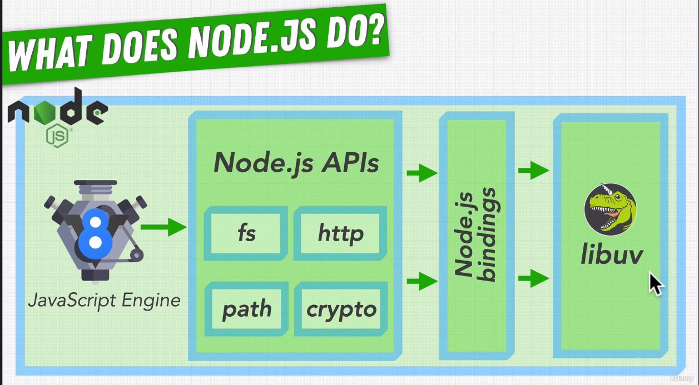

**What does Node.js do**  
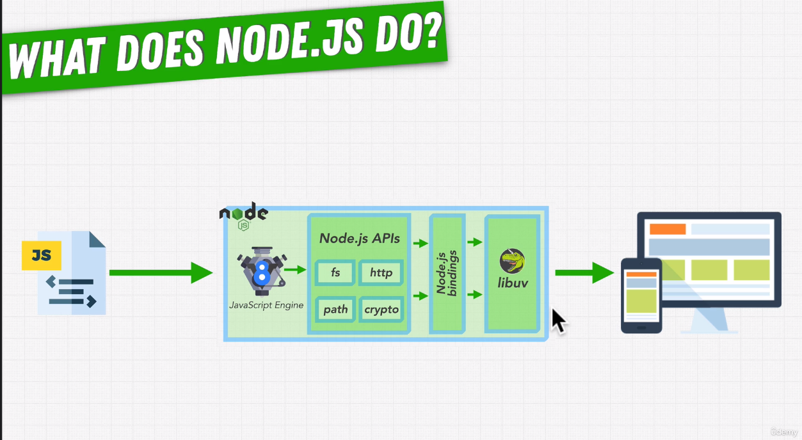

---

## #22 Node.js Internals Deep Dive

**Node.js GitHub Repo**  
Explore Node.js GitHub Repo.

There are 2 important folders "lib" & "src".

lib  
lib has the JavaScript side of Node.js APIs.
Each of the module mentioned in the Node.js documentation lives here,
they have their corresponding files here.

src  
src is on C++ side with our low level Node.js API bindings.
Connects the JavaScript side of Node.js APIs with libuv written in C++.
src folder contains the C++ binding code.

**Example**  
Check the [open](https://nodejs.org/dist/latest-v18.x/docs/api/fs.html#fsopenpath-flags-mode-callback) function of the [File system](https://nodejs.org/dist/latest-v18.x/docs/api/fs.html) module.

Now find `fs.js` in the [lib folder](https://github.com/nodejs/node/tree/main/lib).
Click on [fs.js](https://github.com/nodejs/node/blob/main/lib/fs.js) to open it and
find the function `open`, its [here](https://github.com/nodejs/node/blob/main/lib/fs.js#L544).
Here check the `binding.open` function at the [end](https://github.com/nodejs/node/blob/main/lib/fs.js#L562).
It binds JavaScript API to the respective API in the libuv.

Now find `node_file.cc` in the [src folder](https://github.com/nodejs/node/tree/main/src).
Click on [node_file.cc](https://github.com/nodejs/node/blob/main/src/node_file.cc) to open it and
find the function `Initialize`, its [here](https://github.com/nodejs/node/blob/main/src/node_file.cc#L2609).
Here we can see that there are multiple calls of the `SetMethod`.
These `SetMethod` calls bind/associate JavaScript functions with their respective C++ functions in the libuv.

So remember we were calling `fs.open`, which will be associated to `Open` function in [node_file.cc](https://github.com/nodejs/node/blob/main/src/node_file.cc).
Check this [link](https://github.com/nodejs/node/blob/main/src/node_file.cc#L2621).
Now search `Open` function, its [here](https://github.com/nodejs/node/blob/main/src/node_file.cc#L1841).
It is the C++ implementation of the `fs.open` function.

Here we can see that there are [AsyncCall](https://github.com/nodejs/node/blob/main/src/node_file.cc#L1861) & [SyncCall](https://github.com/nodejs/node/blob/main/src/node_file.cc#L1867) to the `uv_fs_open` function in libuv.

Things that start with `uv_` prefix are references to libuv.
Search with `uv_` in this file and there are multiple occurrences of this.
These are all references to libuv.

**Refer**

- [Node.js GitHub Repo](https://github.com/nodejs/node)
- [libuv GitHub Repo](https://github.com/libuv/libuv)

---

## #23 libuv Internals Deep Dive

**What is libuv?**  
libuv is a multi-platform support library with a focus on asynchronous I/O. It was primarily developed for use by Node.js, but it's also used by Luvit, Julia, uvloop, and others.
Node.js allows us to use "libuv" by connecting to it with Node.js bindings.
Apart from Node.js, libuv is used by many others.

**Refer**  

- [libuv](http://libuv.org/)
- [libuv GitHub](https://github.com/libuv/libuv)

---

## #24 Synchronous vs Asynchronous

**What is Synchronous & Asynchronous execution?**  
In programming "Synchronous" means - the code that runs line by line or in sequence.
"Asynchronous" is the opposite of "Synchronous", it means - the code that does not run line by line.

For most tasks in our programs, its possible for our computer/server to work on
the multiple tasks at the same time, when one piece of code is still executing,
our program moves onto the next piece of code, this is "Asynchronous" code execution.

Often times in your program, there will be some "Asynchronous" functions.
These "Asynchronous" functions run in the background while your JavaScript has already
moved onto the next line of code.

**Code Examples**
Check "2-second-app" application.

---

## #25 Asynchronous Callbacks

**What is Asynchronous Callbacks?**
Callback is a function that is set to execute once an event occurs.

Some real life examples

- wake up when it is sunrise
- go to bed when it is 10 PM
- give me a callback once you reach home
- pay your bills when its due date is reached
etc.

**Code Examples**
Check "3-async-app" application.

---

## #26 Non-Blocking Input & Output

**Blocking Function**  

- Executes synchronously
- So blocks the execution of the next line until it is finished

Example
`JSON.stringify({ food: 'love' });`

**Non-Blocking Function**  

- Executes asynchronously, runs in the background
- So does not block the execution of the next line

Example
`setTimeout(function() { // do something }, 5000);`

**When to use Non-Blocking Function?**  
Operations/processes which are dependent on third party/external services
or other devices like hard disk, camera etc. take longer to finish.
We should handle such operations/processes using Non-Blocking Functions
so that Node.js can continue rest of the operations without blocking the main thread.

Some of the use cases are:

- file operations
- database operations
- using 3rd party services via API calls
- any processes that are long running and can be put into the background
- using camera to take pictures/videos or scan QR code
etc.

---

## #27 Exercise: Is JavaScript Asynchronous?

**Is JavaScript Asynchronous?**  
JavaScript itself is a Synchronous language.
It executes code line by line, in sequence, synchronously.

But it can be manipulated to behave like an Asynchronous language.
We can write Asynchronous code, where we are able to execute
callback function in the future when some event occurs.

Browser and Node.js allows us to write Asynchronous code.

Asynchronous code examples
`setTimeout`

NOTE: Promise/fetch are part of JavaScript since ES6, using it we can write Asynchrounous code.

---

## #28 Multi-Threading, Processes & Threads

**Processes**  
Processes are containers, that contain your Code.
This Code lives in the memory of the Process.

**Processes & Threads**  
Processes also contain one or more Threads.
Threads share memory and code but not call stacks.
Threads execute side-by-side and independently, they don't interfere with each other.

So using multiple threads, processes can execute their code asynchronously.

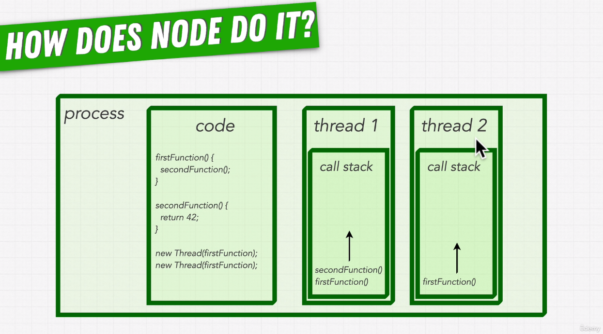

> JavaScript is a single threaded programming language.

---

## #29 Is Node.js Multi-Threaded?

**The Main Thread**  
JavaScript is a single threaded programming language.
So if it is not threads then how does Node.js execute code Asynchronously.

In Node.js we have one main thread which runs

- the V8 JavaScript engine
- Node.js APIs
- libuv (event loop)

**libuv & Thread Pool**  
libuv handles Asynchronous I/O

- file system operations
- network operations
etc.

Inside libuv we have thread pool/collection of threads.
libuv is written in C/C++ which does have threads.

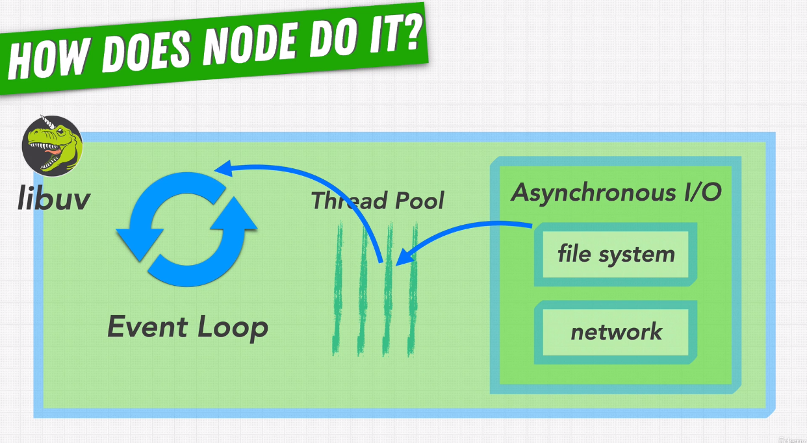

Note that, not all the asynchronous functions are executed in the thread pool.
Wherever possible libuv uses the operating system kernel directly instead of threads.

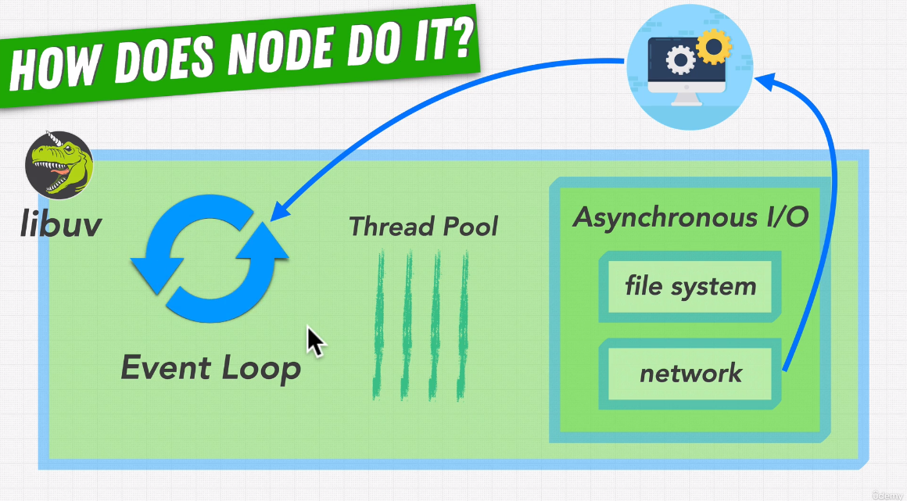

**The Event Loop**  
Using Event Loop code libuv runs Asynchronous function and
when it is finished it executes the corresponding callback function.

In Node.js whenever we call an Asynchronous function from JavaScript
it is put on the Event Loop.

JavaScript executes on the main thread and any Asynchronous functions are put on the Event Loop.

As a Node.js developer we never have to worry about managing multiple threads.
It allows developer to focus more on the application, it also simplifies how you write code.

---

## #30 The Event Loop

**What is Event Loop?**  
The Event Loop is the most important part of the Node.js runtime.
It is responsible for handling all the callback functions in your program.
These callback functions allows Node.js to execute code asynchronously.

Its the Event Loop that allows Node.js program to do multiple things all at once
even though JavaScript is a single threaded language.

Psuedocode for the Event Loop looks like below:

```
// while Node.js code is running
while (!shouldExit) {
    // process all the events, execute corresponding callback when an event occurs
    processEvents();
}
```

The Event Loop is a piece of code in libuv that processes Asynchronous events.

Pseudocode for the Event Loop.

```
// While application is on OR execution is not over.
while (appIsOn) {
    // Check if Micro Task Queue is non empty.
    while (microTaskQueue) {
        // Process callbacks ready for execution from the Micro Task Queue OR the Priority Queue.
        // Set microTaskQueue = false when there are no more callbacks left.
    }

    // Check if Task Queue is non empty.
    while (taskQueue) {
        // Process callbacks ready for execution from the Task Queue OR the Callback Queue.
        // Set microTaskQueue = false when there are no more callbacks left.
    }
}
```

---

## #31 Callback Queues

**What is a Callback Queue?**  
When ready for execution, callbacks are put on the callback queue.

Callback queue keeps track of which callbacks are ready to be executed.

Callback queue is a FIFO queue, that means the functions added first will be executed first.

Other terms for the callback queue are "Event Queue"/"Message Queue".

**Callback Queue (FIFO)**  
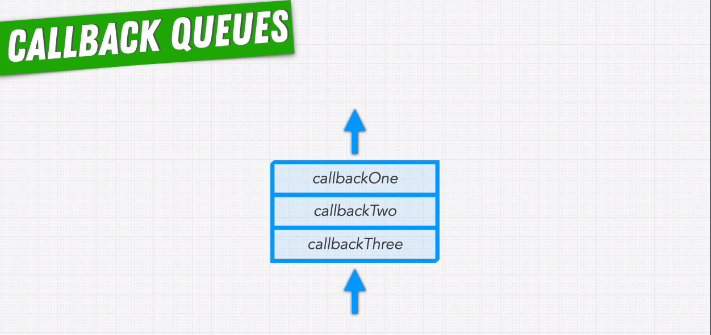

---

## #32 Phases of the Event Loop

**4 Main Phases of the Event Loop**  
There is no one callback queue, there are multiple callback queues.
Each one handles a different phase of the Event Loop.

There are 4 main phases of the Event Loop:

- Timers
- I/O Callbacks
- setImmediate
- Close Callbacks

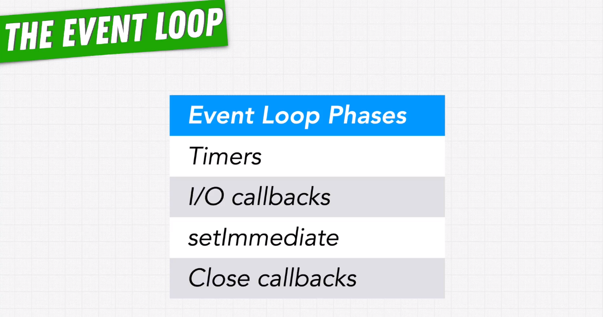

Each of these phases is responsible for a different category of operations that
the Event Loop processes.
Each of these phases has their own queue of callbacks that are executed during that phase.

There are 3 types of timers that we have in Node.js.

- `setTimeout`
- `setInterval`
- `setImmediate`

Event Loop goes through each of these phases one by one in its iteration and
executes callbacks for all of them.

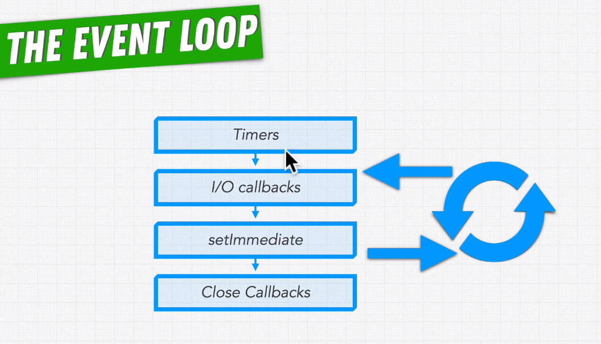

**Refer**  
[The Node.js Event Loop, Timers, and `process.nextTick()`](https://nodejs.org/en/docs/guides/event-loop-timers-and-nexttick/)

---

## #33 Comparing Node.js With PHP & Python

**Node.js Vs PHP/Python**  
PHP & Python are high level "single threaded" languages.
PHP & Python need a web server, e.g., Apache/NGINX to handle multiple client requests.

Each request to Apache is blocking, it is handled by its own thread.
Each client talking to our server will get its own thread.
This means our server will need a lot of threads with a lot of resources being used by those threads.

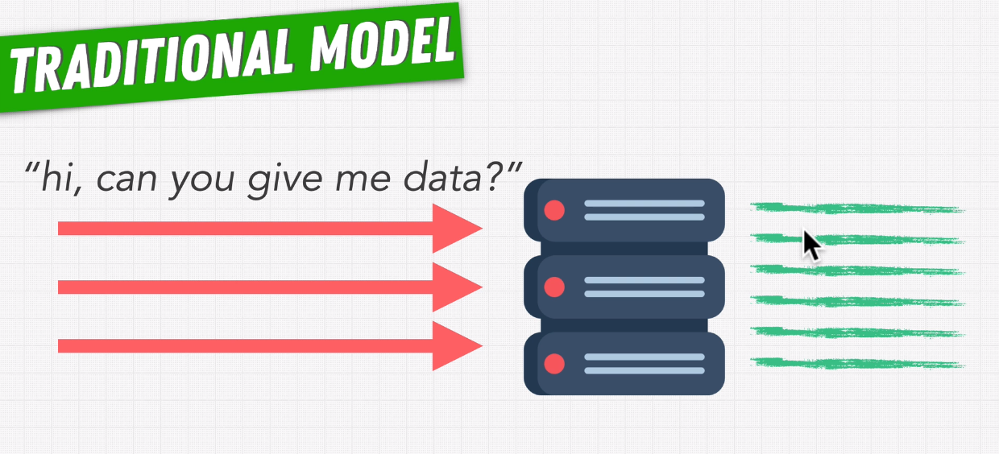

So building a site/app that serves millions of users is quite difficult and expensive.
Server will get crash pretty quickly if it gets a lot of traffick.

Node.js became popular because of its non-blocking I/O.

Node.js doesn't need a server like Apache to handle multiple client requests.

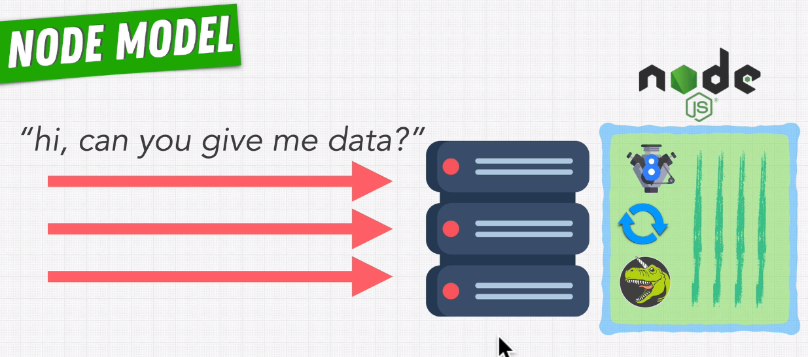

**Refer**  
[Node.JS VS PHP  -  in a nutshell](https://www.hi5.team/blog/node-js-vs-php-in-a-nutshell)

---

## #34 What Is Node.js Best At?

**Node.js is best at creating Web Servers**  
Node.js is best at creating web servers.

Node.js works really well when your main performance problem is input/output
rather than heavy calculations.
If our code blocks the JavaScript or uses CPU heavily then our Event Loop will get stuck,
and then Node.js won't be able to manage the other tasks happening side by side efficiently.
On the other hand Node.js is really good at serving data for I/O heavy applications.

Node.js is not good at

- audio/video processing
- machine learning

---

## #35 Observer Design Pattern

**About Observer Design Pattern?**
We make use of "Observer Design Pattern" to deal with Asynchronous events.

There are two entities involved:  

- Subject
- Observers

Example
Imagine a celebrity, for example "Keanu Reeves".
He is a "Subject".

He has millions of fans who love to "observe" him.
These are "Observers".
Just like they are following him on Twitter.

Observers are subscribed to get updates from the Subject.

Now when Keanu Reeves tweets a post about his latest movie or an event,
all his followers get notified, they get the updates.

Node.js is an asynchronous event-driven JavaScript runtime.

Here event-driven means - a "Subject" can emit one or more events and
its "Observers" are notified about it.

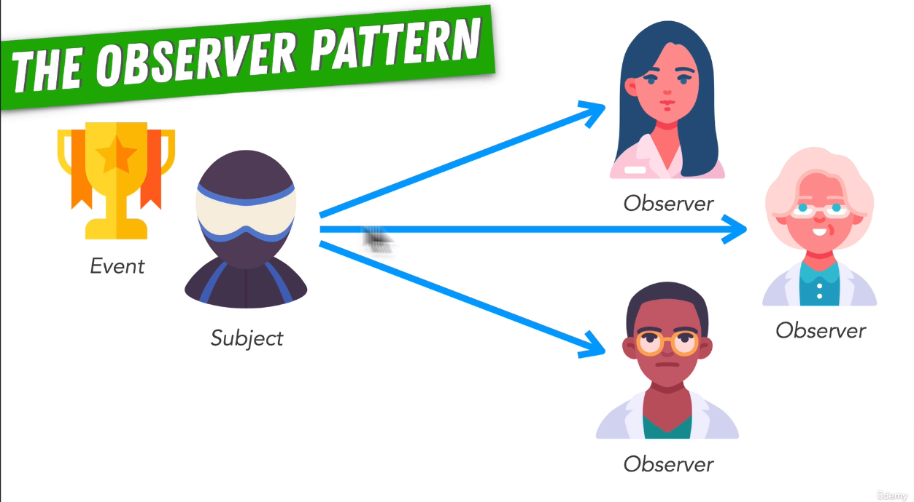

**Refer**  
[About Node.js](https://nodejs.org/en/about/)

---

## #36 The Node.js Event Emitter

**Events Module**  
Node.js has built-in module that helps us to work with events - "Events" module.
[Events](https://nodejs.org/api/events.html#events_events)

When the `EventEmitter` object emits an event, all of the functions attached to that specific event are
called synchronously. Any values returned by the called listeners are ignored and discarded.

The `EventEmitter` object has two methods  

- `on()` method is used to register listeners (callback functions)
- `emit()` method is used to trigger the event

**Code Examples**  
Check "4-event-app" application.

**Refer**  

- [Events](https://nodejs.org/api/events.html#events_events)
- [Process events](https://nodejs.org/api/process.html#process-events)

---

## #372 Appendix: Asynchronous JavaScript > Section Overview

**Asynchronous JavaScript Topics**  

- Web APIs
- Async/Await
- Callbacks
- Microtask Queue (Job Queue)
- Task Queue (Callback Queue)
- Promises
- Event Loop

**JavaScript Runtime**  
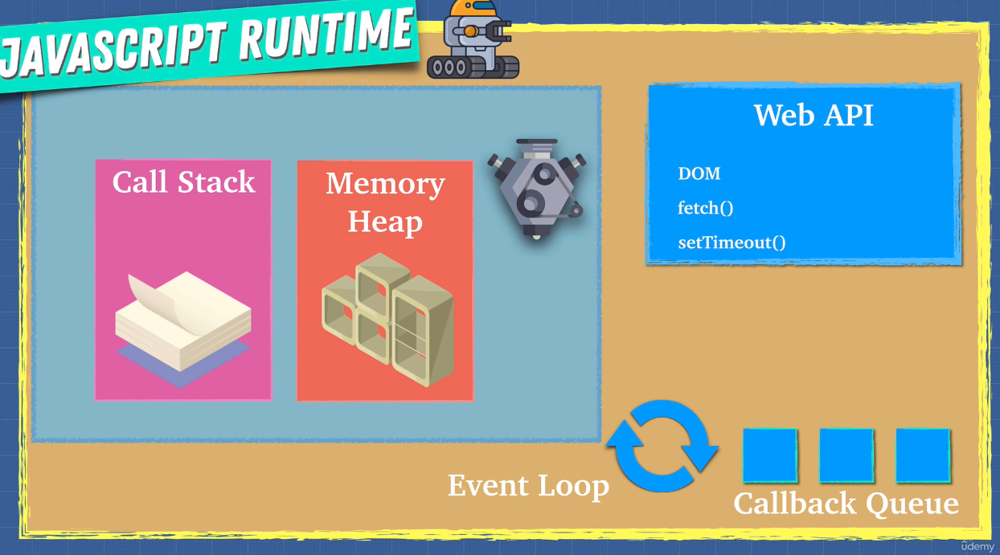

Once JavaScript engine sees something that is asynchronous or something that is timeout which is
the part of the Web API, we send it over to the Web API.
Then the Web API is going to do something for us in the background,
when it is done it will add callback/listener function in the "Callback Queue".
And then the "Event Loop" checks if the "Callstack" is empty and our entire JavaScript file has
been read once. If the "Callstack" is empty it pushes the "Callback" into it.
So the "Event Loop" monitors the "Callstack" and the "Callback Queue".

Once Callstack is empty and entire JavaScript file is read once,
it is time to check and execute callbacks/jobs available in the Callback/Task Queue & Microtask/Priority Queue.

Psuedocode for the Event Loop looks like below:

```
// while Node.js code is running
while (!shouldExit) {
    // process all the events, execute corresponding callback when an event occurs
    // it will push callbacks into "Callback Queue"
    processEvents();

    if (emptyCallStack && !emptyCallbackQueue) {
        // executes callbacks in FIFO order from the "Callback Queue"
        executeCallback();
    }
}
```

The Event Loop is a piece of code in libuv that processes Asynchronous events.

**Refer**  
[replit](https://replit.com/)

---

## #373 Appendix: Asynchronous JavaScript > Promises

**About Promises**  
Promises are a new feature in JavaScript as of ES6.
Promises are part of JavaScript and they provide "native" way of writing/handling
Asynchronous code in JavaScript.

> A promise is an object that may produce
> a single value some time in the future.
> Either a resolved value,
> or a reason that it is not resolved (rejected).

A promise can be in any one of the following stats:

- Pending
- Fulfilled
- Rejected

**Promises Vs Callbacks**  
Prefer Promises over Callbacks.

Nested callbacks make the code hard to read and maintain.
Some examples of the nested callbacks are as below:

"Callback pyramid of doom"

Example #1
```
grabTweets('twitter/johnwick', (error, johnWickTweets) => {
    if (error) {
        throw Error;
    }

    displayTweets(johnWickTweets);

    grabTweets('twitter/ironman', (error, ironManTweets) => {
        if (error) {
            throw Error;
        }

        displayTweets(ironManTweets);

        grabTweets('twitter/thor', (error, thorTweets) => {
            if (error) {
                throw Error;
            }

            displayTweets(thorTweets);
        });
    });
});
```

Example #2
```
movePlayer(100, 'Left', function() {
    movePlayer(400, 'Left', function() {
        movePlayer(10, 'Right', function() {
            movePlayer(330, 'Left', function() {
                // some code...
            });
        });
    });
});
```

Using Promises we can rewrite the above examples as follows:

Example #2
```
movePlayer(100, 'Left')
    .then(() => movePlayer(400, 'Left'))
    .then(() => movePlayer(10, 'Right'))
    .then(() => movePlayer(330, 'Left'));
```

Promises are very useful in writing Asynchronous code.

`fetch()` function returns a Promise.

NOTE:
Promises execute when we attach "then()" or prefix it with "await".

An Asynchronous function is a Promise which needs to be resolved/rejected.
So when we call such a function it returns a Promise.
We need to wait for the results, so we put await in front of it to get results.

OR the other way is once Promise is fulfilled or rejected then we take next steps.
So we attach "then()" and provide a callback to perform next steps.

**Code Examples**  
Check "5-resolved-rejected-promises" application.  
Check "6-multiple-promises" application.

**Refer**  
[SWAPI - Star Wars API Integrations](https://pipedream.com/apps/swapi)

---

## #374 Appendix: Asynchronous JavaScript > ES8 - `async`, `await`

**About `async`, `await`**  
`async`, `await` are part of ES8 and they are built on top of Promises.

An async function returns a Promise.

`async`, `await` makes the Asynchronous code look like the Synchronous code,
which is even more readable.

Examples

```JavaScript
// Using the Promise
movePlayer(100, 'Left')
    .then(() => movePlayer(400, 'Left'))
    .then(() => movePlayer(10, 'Right'))
    .then(() => movePlayer(330, 'Left'));

// Using aync await
async function playerStart() {
    await movePlayer(100, 'Left'); // pause
    await movePlayer(400, 'Left'); // pause
    await movePlayer(10, 'Right'); // pause
    await movePlayer(330, 'Left'); // pause
}

playerStart(); // this will execute asynchronously
// await playerStart(); // this will execute synchronously, we are waiting for playerStart() to complete.


// Using the Promise
fetch('https://jsonplaceholder.typicode.com/users')
    .then((response) => response.json())
    .then((jsonResponse) => console.log(jsonResponse));

// Using aync await
async function fetchUsers() {
    const response = await fetch('https://jsonplaceholder.typicode.com/users');
    const jsonResponse = await response.json();
    console.log(jsonResponse);
}

fetchUsers(); // this will execute asynchronously
// await fetchUsers(); // this will execute synchronously, we are waiting for fetchUsers() to complete.
```

**Code Examples**  
Check "7-async-await" application.

---

## #375 Appendix: Asynchronous JavaScript > ES9 (ES2018)

**Object Spread Operator**  
[Spread syntax (...)](https://developer.mozilla.org/en-US/docs/Web/JavaScript/Reference/Operators/Spread_syntax)

**Code Examples**  
Check "8-object-spread-operator" application.

---

## #376 Appendix: Asynchronous JavaScript > ES9 (ES2018) - Async

Using `finally` in the Promises.

Using `for await` to loop through the Promises.

**Code Examples**  
Check "9-promise-finally" application.
Check "7-async-await" application.

---

## #377 Appendix: Asynchronous JavaScript > Job Queue

**Microtask Queue Vs Task Queue**  
Microtask Queue (Job Queue)
Callbacks in the Asynchronous code which is part of the JavaScript (like Promises)
are put on the Microtask Queue/Job Queue.

Task Queue (Callback Queue)
Callbacks in the Asynchronous code which is not part of the JavaScript (like setTimeout)
are put on the Task Queue/Callback Queue.

setTimeout is a part of the Web API.

> The Microtask Queue/Job Queue has higher priority over the Task Queue/Callback Queue.
> So the Event Loop checks and executes all the callbacks from the Microtask Queue/Job Queue
> first and then the Task Queue/Callback Queue.

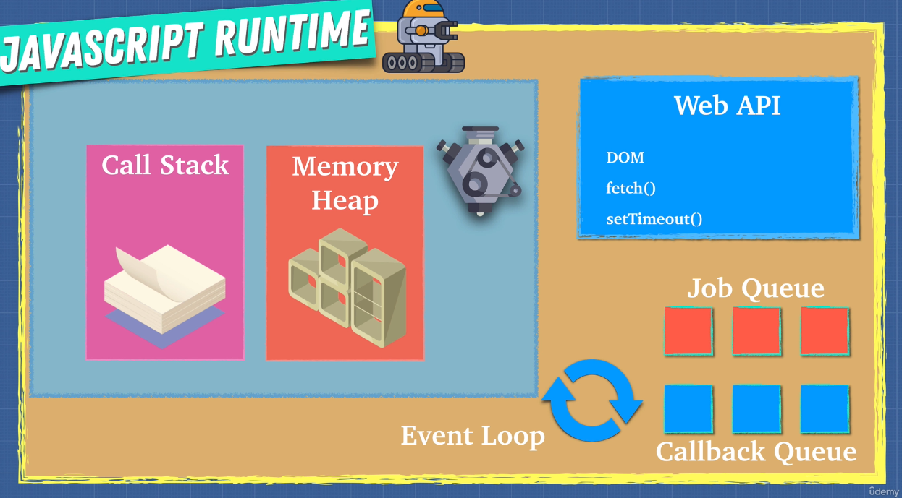

**Code Examples**  
Check "3-async-app" application.

---

## #378 Appendix: Asynchronous JavaScript > Parallel, Sequence & Race

**3 ways to execute Promises**  

Promises can be executed in 3 ways  

- Parallel
- Sequencial
- Race

Parallel
`Promise.all()`
Promises execute in parallel to each other.
Callback will be executed once all of them finishes their execution.

Sequencial
Promises execute in sequence, one after the other.
Callback will be executed once all of them finishes their execution.

Race
`Promise.race()`
Technically all Promises will start at the same time, they run in parallel.
Hence there is a race, the one which finishes first is a winner.
As soon as one of the Promises finishes first, Callback will be executed.

NOTE: Is there a limit for how many promises can run in parallel?

**When to use what?**  
If we want to execute all of the promises regardless of their order of execution
then we should use Parallel method.

If we want to execute all of the promises in a specific order
then we should use Sequence method.

If we want to execute all of the promises but move forward with the one
which finishes first then we should use Race method.

**Parallel, Sequence, Race which is fastest?**  

Lets take an example,
assume there are 3 promises - first, second, third.
first takes 10 milli seconds, second takes 20 milli seconds & third takes 30 milli seconds
to complete.

When using Race, the first promise will be completed first,
so it takes 10 milli seconds.

When using Parallel, all promises will execute in parallel,
it will take at least 30 milli seconds.

When using Sequencial, all promises will execute one after the other,
so it will take at least 10 + 20 + 30 = 60 milli seconds.

Race > Parallel > Sequence

**Code Examples**  
Check "10-promises-parallel" application.
Check "11-promises-race" application.
Check "12-promises-sequence" application.

---

## #379 Appendix: Asynchronous JavaScript > ES2020: allSettled()

**`all()` vs `allSettled()`**  
`allSettled()` in promises is part of ES2020.

When all the promises inside `Promise.all` are resolved, it executes the callback in `then`.
If anyone of them fails then it executes the callback in `catch`.

When all the promises inside `Promise.allSettled` are settled, it executes the callback in `then`.

When promise finishes its execution it can be in either Fulfilled/Resolved or Rejected status,
and we say that the promise is settled now, it is no more in Pending status.
When a promise is settled, it can be in either Fulfilled or Rejected status.

`allSettled()` executes all the promises regardless of their status,
it gives chance to execute all of the promises.
Whereas `all()` finishes as soon as one of the promises failed to resolve.

`allSettled()` returns an array of settled promises.
When all of the promises resolved `all()` returns an array of result of the resolved promises,
if one or more promises are rejected then `all()` executes catch block to handle failure
or throws an exception if catch block is not present.

**Code Examples**  
Check "13-allSettled" application.

---

## #380 Appendix: Asynchronous JavaScript > Threads, Concurrency & Parallelism

**Threads, Concurrency & Parallelism**  
A web worker is a JavaScript program running on a different thread in parallel to our main thread.

Concurrency in single core CPU  
Since there is a single CPU, it can only execute one thread at a time.
So CPU switches between multiple threads.

Concurrency & Parallelism in multi core CPU  
Since there are multiple CPUs, it can execute multiple threads simultaneously or in parallel.

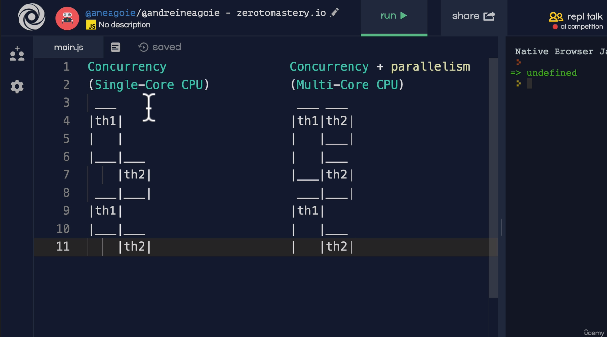

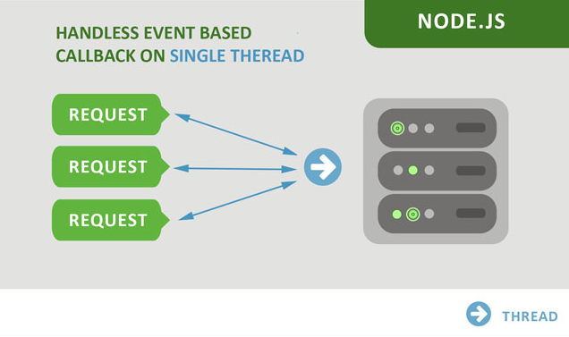

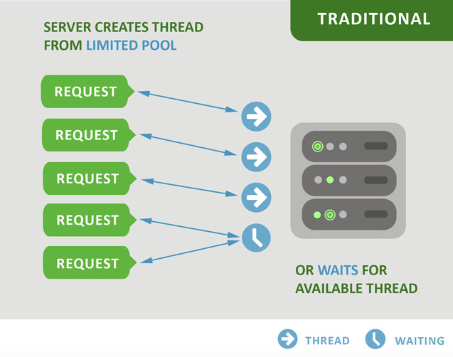

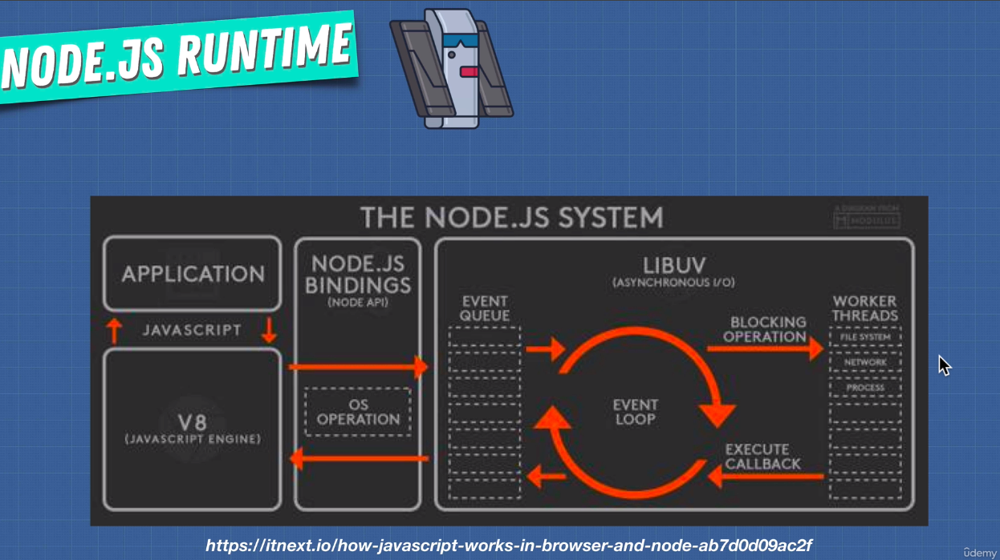

**Refer**  

- [Scaling Node.js Applications](https://www.freecodecamp.org/news/scaling-node-js-applications-8492bd8afadc/)
- [Child processes](https://nodejs.org/api/child_process.html)

---

## #38 The require Function

**Use require to reuse a Module**  
We can breakdown and organize our code into smaller more manageable files - the modules.
We can reuse the modules as per the requirements.

Node has a built-in function called `require()` which is not part of the JavaScript.
`require()` takes a JavaScript file, executes it and then returns the code from that file
so that we can reuse it elsewhere.

We can require any of the built-in modules, like
`require('http')`
`require('events')`
by passing in the name of the module as a string.


---

## #39 Making HTTP Requests

**Refer**  

- [Node.js | HTTP](https://nodejs.org/dist/latest-v18.x/docs/api/http.html)
- [Node.js | HTTPS](https://nodejs.org/dist/latest-v18.x/docs/api/https.html)

**Code Examples**  
Check "14-http-app" application.

---

## #40 Why Use Modules?

**Module and its benefits**  

What is a Module?
Imagine a module as a box.
This box contains some code which is dedicated to doing one thing well.
We can name/label this box.

We can then combine/use multiple modules to create our app.

So generally an app relies/depends on multiple modules.

Benefits of using modules:

1. Reuse existing code. DRY principle.
2. Organize your code. Clean & maintainable code.
3. Expose only what will be used. Encapsulation. Blackbox.
   Implementation details relevant to the module are kept hidden from the outside world.
   Lower level details remain hidden.
4. Responsible for doing one thing well. S in SOLID - Single Responsibility.

---

## #41 Creating Our Own Modules

**Creating & using modules in our app**  

We can create our modules and use them in our app.

Functions and variables in a module are private to that module,
that means we can't access them from other modules.
To use them in other modules we need to "export" them.

"module" is a global built-in that contains data related to the current module.
`console.log(module);` do this in your module and check the results.

The functions and variables of a module that we want to be available in other modules
need to be set using `module.exports` object.

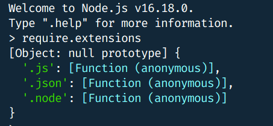
require function by default looks for the .js files first,
then it looks for .json and then at last .node files.

binary .node files is an advanced feature, where we can write add-on in C++
and import it as a Node.js module.

**Code Examples**  
Check "15-modules-example" application.

---

## #42 Exporting From Modules

**Exporting From Modules**  
Use the following recommended style to export the things from the module.

```JavaScript
module.exports = {
    one,
    two,
    three
    // and so on...
};
```

Benefits of using this method are,

- all the things which are exported from the module are in one place.
- it becomes very easier to locate and check all the exported things.

---

## #43 CommonJS vs ECMAScript Modules

**CommonJS vs ECMAScript Modules**  

When we use `require` function, we are using CommonJS modules.
In other words CommonJS modules are imported using `require` function,
and they are exported using `module.exports`.
CommonJS is mostly known for being used in Node.js.
It is also used in MongoDB.

CommonJS modules
import => use `require` function
export => use `module.exports` statement
It is used in Node.js and MongoDB.

ECMAScript Modules are also known as ES6 modules or ESM for short.
ES6 modules are imported using `import` statements and exported using `export` statement.

ECMAScript Modules/ES6 Modules
import => use `import` statement
export => use `export` statement
It is used in Browser side & Node.js as well.

**Refer**  

- [CommonJS Modules](https://nodejs.org/dist/latest-v18.x/docs/api/modules.html)
- [ECMAScript Modules](https://nodejs.org/dist/latest-v18.x/docs/api/esm.html)
- [JavaScript import](https://developer.mozilla.org/en-US/docs/Web/JavaScript/Reference/Statements/import)
- [JavaScript export](https://developer.mozilla.org/en-US/docs/Web/JavaScript/Reference/Statements/export)
- [Modules: CommonJS modules](https://nodejs.org/api/modules.html#modules_modules_commonjs_modules)

---

## #44 Creating Our Own ECMAScript Modules

**CommonJS module by default**  

Node.js treats JavaScript file as CommonJS module by default for backwards compatibility.
Node.js has been using CommonJS since it was created.

**To use ES6 module**  

We need to explicitly tell it to treat your code as an ECMAScript module by naming the file
with .mjs extension, where "m" stands for module.

To load an ES6 module, set `"type": "module"` in the `package.json` or use the `.mjs` file extension.

**Code Examples**  
Check "16-es6-modules-examples" application.

**Refer**  

- [ESM](https://nodejs.org/api/esm.html)
- [Mandatory file extensions](https://nodejs.org/api/esm.html#mandatory-file-extensions)

---

## #45 Module Caching

**About Module Caching**  

In a large application, it is very likely that we require the same module at multiple places.

Node.js maintains a cache of required modules,
which is basically a little database of these required modules
that Node.js checks before loading any module.

So if the module is already loaded then it will be found in the cache
and Node.js won't load it again, if the module is not found in cache
then that module is loaded and then cached.
That way Node.js ensures that the required modules are loaded only once.

This cache is "global" and lives under `require.cache` object.
We can check it using `console.log(require.cache)`.

Node.js uses built-in module `require` and `require.cache` object to
implement CommonJS module functionality.
We can't edit built-in module `require`.

**Code Examples**  
Check "15-modules-example" application.

No, ESM/ES6 Modules in Node.js handle caching differently than CommonJS modules.

### How Caching Works with ESM

ES Modules implement their own caching mechanism that is distinct from the `require.cache` object
used by CommonJS. Here's how it works:

- **Module Identity**: Node.js identifies each ES module by its full, resolved URL. When an `import` statement is executed, Node.js checks a module map to see if that URL has already been loaded.
- **First Import**: The first time a module is imported, Node.js fetches it, parses it, and adds it to the module map.
- **Subsequent Imports**: Any subsequent `import` statement for the same URL will simply return a reference to the already-loaded module from the map.

Unlike `require.cache`, there is no public, built-in object that you can inspect or manipulate to view the ESM cache. The caching is handled internally by Node.js, providing a more reliable and encapsulated system. This design prevents unintended side effects that could occur from directly modifying a global cache.

**Refer**  

- [Modules Caching](https://nodejs.org/api/modules.html#caching)

---

## #46 Using `index.js`

**How `index.js` inside a folder works**  

`index.js` is a special case in Node.js.
It allows us to treat a folder like a module.

When we pass path to a folder to the `require()` function,
it results to the `index.js` file inside of that folder.

The `index.js` file exports an object that contains all the data & functions
that we want to export from the folder.

The `index.js` allows us to import/export multiple modules grouped into a folder.

**Code Examples**  
Check "17-modules-example-v2" application.

---

## #47 Should We Use `index.js`?

**Should We Use `index.js`?**  

This is a controversial subject among Node.js developers.
Some love to use it and some don't.

It is preferred by many developers - not to use `index.js`.
"Ryan Dahl" himself pointed out this in his talk "10 Things I Regret About Node.js" about this.
Things are much more simpler when we don't use `index.js`,
it just adds additional layer around import/export that we can avoid.

**Refer**  

- [10 Things I Regret About Node.js - Ryan Dahl - JSConf EU](https://www.youtube.com/watch?v=M3BM9TB-8yA)
- [Modules All together](https://nodejs.org/api/modules.html#modules_all_together)

---

## #48 NPM: The Node Package Manager

**About npm**  

npm is the package manager for Node.js.

Packages are bundles of code that we can reuse.

Node.js has really really large ecosystem of libraries, we can find them at [npmjs.com](https://www.npmjs.com/).

We use "npm" cli tool to manage and work with 3rd party packages in our application.

**Refer**  
[npmjs.com](https://www.npmjs.com/)

---

## #49 Creating Our First NPM Package

**module vs package**  

A module is a file that contains some code which we can export to use it.
A package is a collection of modules that have been packaged together to deliver a feature/functionality.

**Initialize as package**  

Run `npm init` command to initialize our application as an npm package.
It will create `package.json` file that contains all the necessary information.

**Install a package**  

We can install a package using `npm install` command.

**Setting up a start script**  

Set a start script to run our application using `npm run start` or `npm start` command.

```JSON
/* inside package.json file */
  "scripts": {
    "start": "node https.js",
```

**Refer**  
[npm CLI](https://docs.npmjs.com/cli/v9/commands)

---

## #50 Packages And The NPM Registry

**Packages And The NPM Registry**  

package.json file only exists inside the Node.js packages.
Most Node.js programs/applications are actually packages.
They need to be packages in order to make use of other npm packages.

We might not publish our package on [npmjs.com](https://npmjs.com).

[npmjs.com](https://npmjs.com) is the registry where many reuseable packages are registered
and available for free to use to everyone.

---

## #51 Using Third Party Modules

**axios package**  
Install and use axios package into our project.

**Code Examples**  
Check "19-package-example" application.

---

## #52 The node_modules Folder

**node_modules**  

node_modules folder is at the root of our package/application.
It contains all the 3rd party packages that we have installed using npm CLI tool.

When we install any package using npm CLI tool, it gets downloaded from the npm registry
and then it is saved into the node_modules folder.

Now Node.js will load the dependencies from the node_modules folder.

**Never ever modify the code inside node_modules**  

Its a bad idea to modify the code of the packages that are into node_modules folder.
The 3rd party packages should be managed (install, update or remove) by npm CLI tool only.

**node_modules contains all the dependencies**  

node_modules folder contains direct as well as indirect dependencies of our application.
In other words node_modules contains direct dependencies and also contains dependencies
of those dependencies (also called transitive dependencies).

npm downloads and puts all the dependencies side by side into the node_modules folder.
It does not create any nested folder structure.

For example,
When we install "axios" package, its dependency "follow-redirects" is also installed.
npm puts "axios" and "follow-redirects" side by side into the node_modules folder.

So it looks like:
node_modules
    axios
    follow-redirects

Our application dependencies create a dependency tree.

**Heaviest object in the Universe meme**  


This comes from the early days of Node.js when the dependencies were duplicated,
and we would have to do things like remove node_modules folder if things became
corrupt during an install, which would happen fairely often.

But now npm has improved exponentially, especially in the past few years.

**node_modules must be inside .gitignore**  

We don't need to share application dependencies when we share our code.
Application dependencies can be installed from scratch using `npm install`
command using the information provided in the package.json & package-lock.json files.
So we put node_modules inside .gitignore file.

---

## #53 Semantic Versioning

**MAJOR.MINOR.PATCH**  
Given a version number MAJOR.MINOR.PATCH, increment the:

1. MAJOR version when you make incompatible API changes
2. MINOR version when you add functionality in a backward compatible manner
3. PATCH version when you make backward compatible bug fixes

**MAJOR**  
It can introduce breaking changes, major changes to the previous version.
One or more features/functionality may be deprecated.

**MINOR**  
Additional functionality with backward compatibility.
It must not introduce any breaking changes.

**PATCH**  
No new functionality.
Security Fixes OR Bug Fixes which are important for the ongoing support/maintenance.
It must not introduce any breaking changes.

**Refer**  

- [Semantic Versioning](https://semver.org/)
- [About Semantic Versioning](https://docs.npmjs.com/about-semantic-versioning)

---

## #54 package-lock.json and Versioning

**When package-lock.json is created?**  
The package-lock.json is automatically created/updated
whenever we run `npm install` or `npm update` command.

**Dependency Information**  
package-lock.json contains information about what all the dependencies are installed in our application
with their exact version.

Check the following example:

```JSON
  "dependencies": {
    ...
    "axios": {
      "version": "1.3.3",
      "resolved": "https://registry.npmjs.org/axios/-/axios-1.3.3.tgz",
      "integrity": "sha512-eYq77dYIFS77AQlhzEL937yUBSepBfPIe8FcgEDN35vMNZKMrs81pgnyrQpwfy4NF4b4XWX1Zgx7yX+25w8QJA==",
      "requires": {
        "follow-redirects": "^1.15.0",
        "form-data": "^4.0.0",
        "proxy-from-env": "^1.1.0"
      }
    },
    ...
```

version  
The exact version installed.

resolved  
The location from where the dependency is resolved/coming.

integrity  
It confirms that the installed package is not corrupted.

requires  
What are the dependencies of it.

> By using package-lock.json we ensure that the same version of dependencies will be
> installed whenever a project is setup again on the same or different system.

**Sementic Versioning Calculator**  
We can use [npm semver calculator](https://semver.npmjs.com/) to check the range of a
dependency which can be installed/updated.

MAJOR.MINOR.PATCH  

`>` or `>=` allows to update MAJOR, MINOR & PATCH versions.

`^` allows to update MINOR & PATCH versions.

`~` allows to update only PATCH versions.

Special Case for pre 1.0 versions.
For example, go to [npm semver calculator](https://semver.npmjs.com/) and check "lodash" package for "^0.8.0" version.
MINOR version is treated as a MAJOR version,
and so in this case it allows to update only PATCH version.

---

## #55 Vulnerabilities In Dependencies

**Identifying and fixing security vulnerabilities**  
`npm audit`  
Runs a security audit.

`npm audit fix`  
Fixes security vulnerabilities by updating the packages.

`npm audit` will only highlight issues that have been already reported/discovered.
And it can fix them automatically using `npm audit fix` if there is an available update for it.
If there is no update available for the reported package then we need to switch to
an alternative package which is more secure.

---

## #56 Installing NPM Tools: nodemon

**Refer**  
[nodemon](https://www.npmjs.com/package/nodemon)

---

## #58 Code For This Section

**Refer**  
[Planets Project](https://github.com/odziem/planets-project)

---

## #59 Exploring Planets With Node.js

**Refer**  
[NASA's Kepler Spacecraft](https://www.nasa.gov/mission_pages/kepler/launch/index.html)

---

## #60 Importing Kepler Space Telescope Data

**Refer**  
[NASA Exoplanet Archive](https://exoplanetarchive.ipac.caltech.edu/docs/data.html)

---

## Setting scripts for the project

In the package.json file we can set scripts for the project.
For example check the following:
```
  "scripts": {
    "start": "node index.js",
    "dev": "nodemon index.js",
    "test": "echo \"Error: no test specified\" && exit 1"
  },
```
Here we have set 3 scripts - start, dev & test.

We can execute the available script using `npm run <script-name>` command.

---

## #61 Setting Up Our CSV Parser

**File System Module or csv-parse package**  
We can read data from a file using Node.js [File System](https://nodejs.org/api/fs.html) module.
But we will use 3rd party package [csv-parse](https://www.npmjs.com/package/csv-parse) to read and parse the CSV file.

**Refer**  
[Node.js | File System](https://nodejs.org/api/fs.html)
[CSV parser for Node.js and the web](https://www.npmjs.com/package/csv-parse)
[CSV Parser for Node.js | Documentation](https://csv.js.org/parse/)
[Are we alone in the universe?](https://exoplanets.nasa.gov/search-for-life/can-we-find-life/)

---

## #63 Streaming Large Data Files

**Streams in Node.js**  
In Node.js all streams are implemented using the event emitter.
Where the events are emitted by Node.js and we just react to the events
on that stream using the "on" function.

**Refer**  
[csv-parse | Node.js Stream API](https://csv.js.org/parse/api/stream/)

---

## #64 Reading Our Planets Data

**fs.createReadStream**  
Read the file using [fs.createReadStream](https://nodejs.org/api/fs.html#fscreatereadstreampath-options) function.

**Refer**  
[Creating Read Streams in Node.js](https://nodejs.org/api/fs.html#fs_fs_createreadstream_path_options)

**Code Examples**  
Check "20-planets-project" application.

---

## #65 Parsing Our Planets Data

**`readable.pipe(writable);`**
`fs.createReadStream('./kepler_data.csv')` is piped to a writable stream.

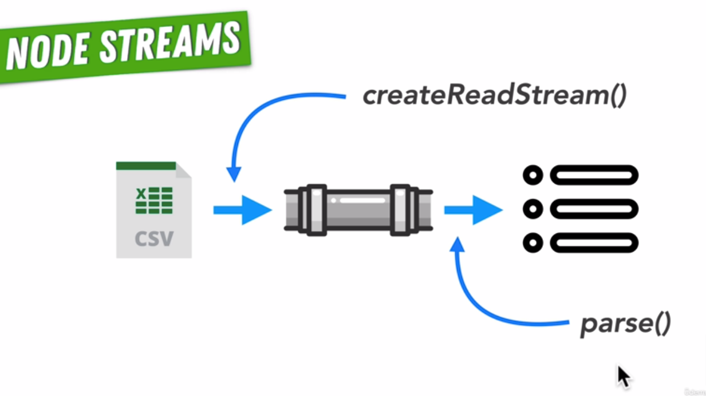

A readable stream provides input for a writable stream.
`readable.pipe(writable);`

readable stream = the data that comes in from some source.
writable stream = the data that will be processed.

**Code Examples**  
Check "20-planets-project" application.

---

## #66 Finding Habitable Planets

**Refer**  
[Review of the Best Habitable Planet Candidates](https://www.centauri-dreams.org/2015/01/30/a-review-of-the-best-habitable-planet-candidates/)

---

## #67 Exploring Habitable Planets

**Refer**  
[The Habitable Exoplanets Catalog](https://phl.upr.edu/projects/habitable-exoplanets-catalog)

---

## #69 What is a Web Server?

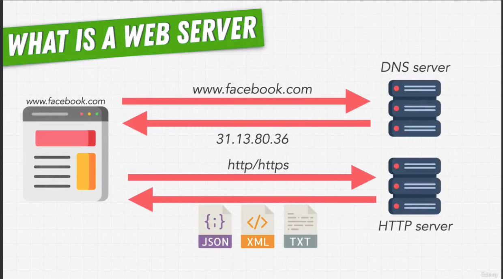

Node.js is used to build back-ends of Web/Mobile applications.

Background  
Client/browser make request to our Web/Mobile application servers by hitting a URL.
These request URLs have the domain name of our application.
First the request goes to DNS server where domain name is resolved and it gives mapped internet address/IP address of the application server.
IP address is then cached and used in subsequent requests to the application server.
Client and Server communicate using HTTP/HTTPS protocol.

---

## #70 Introduction to HTTP Requests and Responses

Reference  
[HTTP request methods](https://developer.mozilla.org/en-US/docs/Web/HTTP/Methods)

---

## #71 HTTP Requests

HTTP Requests Example  
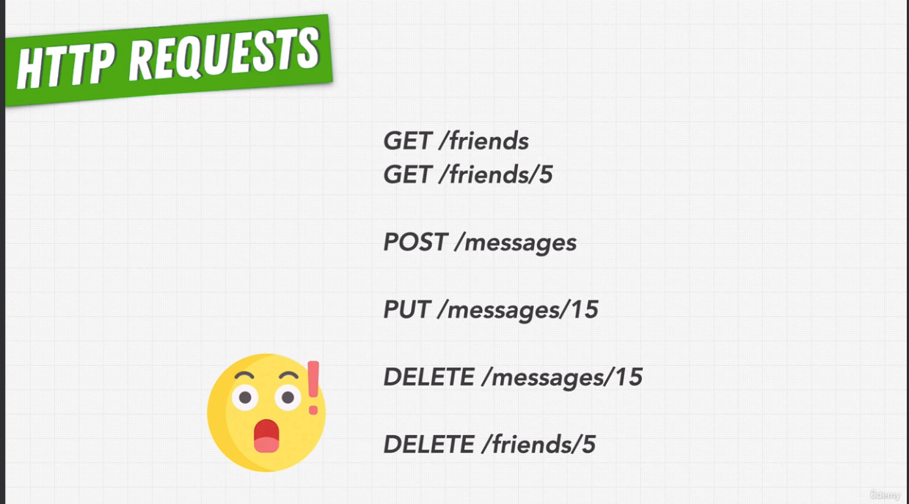

HTTP Request Format  
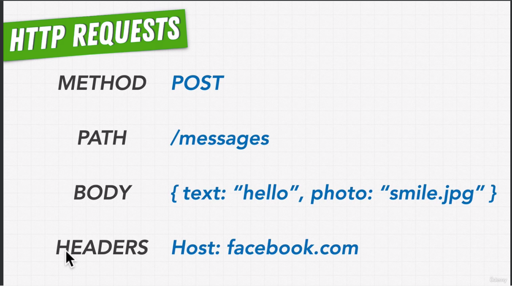

An HTTP Request is consist of 4 things:  

- Method/HTTP Verbs
    GET, POST, PUT, DELETE etc.
- Path/Resource
    The resource that we want to access, create, delete etc.
- Headers
    They are data about data - meta data.
    There is always at least one header in each of the request, it is "Host".
- Body (Optional)
    The request data that we may provide while making a request.

More about Request Headers:  

- These are optional depending on your use case, but there's one header that every single request needs
to have.
- It's the "host" header, which specifies which server your request is being sent to, including sometimes
the port number for that site.
- The "host" needs to be specified to verify that you're sending your message to the right server.

Reference  
[What is an API?](https://www.mulesoft.com/resources/api/what-is-an-api)  
Many people ask themselves, "What is an API?" API is the acronym for application programming interface - a software intermediary that allows two applications to talk to each other. APIs are an accessible way to extract and share data within and across organizations.

APIs are all around us. Every time you use a rideshare app, send a mobile payment, or change the thermostat temperature from your phone, you're using an API.

---

## #72 HTTP Responses

HTTP Response Format  
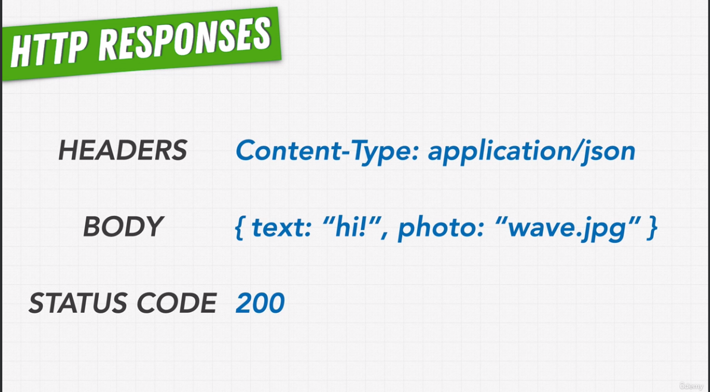

An HTTP Request is consist of 3 things:  

- Headers
- Body
- Status Codes

Reference  
[HTTP response status codes](https://developer.mozilla.org/en-US/docs/Web/HTTP/Reference/Status)

---

## #73 Our First Webserver

**Code Examples**  
Check "21-first-http-server" application.

---

## #74 HTTP APIs and Routing

**Code Examples**  
Check "22-first-http-server-v2" application.

---

## #75 Parameterized URLs

**Code Examples**  
Check "22-first-http-server-v2" application.

---

## #76 Same Origin Policy

What is an Origin?
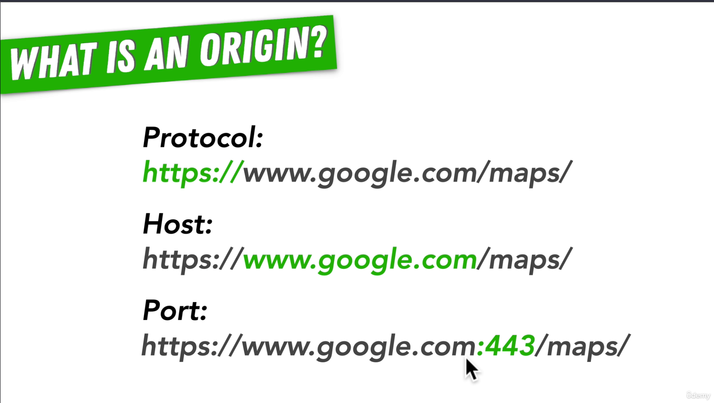

Origin is made up of 3 things:  
Origin = Protocol + Host + Port

Why this is important?  
Because your browser/JavaScript uses the Same Origin Policy.

**Same Origin Policy**  

The same origin policy is a security feature by your browser that restricts what your
browser is allowed to load when you're browsing pages on the internet.

Say you're browsing a page on https://www.wikipedia.org. In general, will the following requests succeed, or fail?

1. A JavaScript GET request to www.bank.com.

2. A JavaScript POST request to www.bank.com.

3. Clicking an HTML link to a video on www.bank.com.

There are possible exceptions, but in general the following will be true:

1. This request will FAIL, because requests to get information from a cross-origin domain are not allowed by the browser. The browser is trying to protect your privacy by preventing https://www.wikipedia.org from stealing your private information from https://www.bank.com.

2. This request will SUCCEED. This is a little known exception to the Same Origin Policy! The decision to allow POST requests is mostly historical, but there is also a lower chance that a POST request will steal your private information. POST requests are used to write data to a server, rather than GET data from it, so it's less likely the response will contain private information.

3. This request will SUCCEED. The Same Origin Policy applies only to scripts and not static resources like HTML tags.

---

## #78 CORS (Cross Origin Resource Sharing)

**CORS**  

As a security feature, Browsers by default,
block cross origin requests so that you don't leak your data
to a site unintentionally.

We can allow cross origin requests that we expect
by sending this special header "Access-Control-Allow-Origin" in the response.

"Access-Control-Allow-Origin": "*"
Allows all requests from any site.

"Access-Control-Allow-Origin": ""
Whitelisting a specific set of sites (this is security best practice).

It's a way of relaxing the restrictions that the same origin policy puts on us developers.
So that we can make applications that potentially span many different domains and origins because the
same origin policy generally limits us in the browser to talking to just one origin.

Example,
Check how Wikipedia loads contents on its website.
https://en.wikipedia.org/wiki/Machine_learning
Check requests in the "Network" tab.

Check how the images are loaded in the "Network" tab.
They are loaded from a different domain - https://en.wikipedia.org.
For all of them if we check their Response Headers we can see that "access-control-allow-origin" is set to "*".
That is why it is possible to load images on the Browser even if it is coming from the different domain.

This CORS header ("access-control-allow-origin" set to "*") allows us as developers to allow an exception when we know requests from a different
domain are safe and expected.
This header is always set on the response.
And as controlled by the server who owns the data.

CORS follows the practice of "whitelisting".

**Whitelisting**  

> Whitelisting is the practice of explicitly allowing
> access to a particular privilege or service.
> It is the opposite of Blacklisting.

You can only allow requests to your server from the list of domains you trust by setting the CORS header.
"access-control-allow-origin"

When you follow blacklisting, it's really easy to miss one of the people or privileges that you want to block.

In whitelisting, you deny access by default and only allow access to a pre-approved list of people or services.

Blacklisting => Allow by default, block a list of people/services.
Whitelisting => Block by default, allow a list of people/services.

When it comes to security,
it's always better to whitelist than it is to blacklist.

And that's what the "access-control-allow-origin" header does.

The origins that you allow in the header are your whitelist.
And you're denying all other origins.

---

## #79 POSTing data to the server

**Code Examples**  
Check "22-first-http-server-v2" application.

---

## #80 Requests and Responses as Streams

**Code Examples**  
Check "22-first-http-server-v2" application.

---

## #84 Introduction to Express

**Code Examples**  
Check "23-hello-expressjs" application.

---

## #86 Route Parameters

**Code Examples**  
Check "23-hello-expressjs" application.

---

## #88 Development Dependencies

**Code Examples**  
Check "23-hello-expressjs" application.

---

## #89 Middleware

Without Middleware  

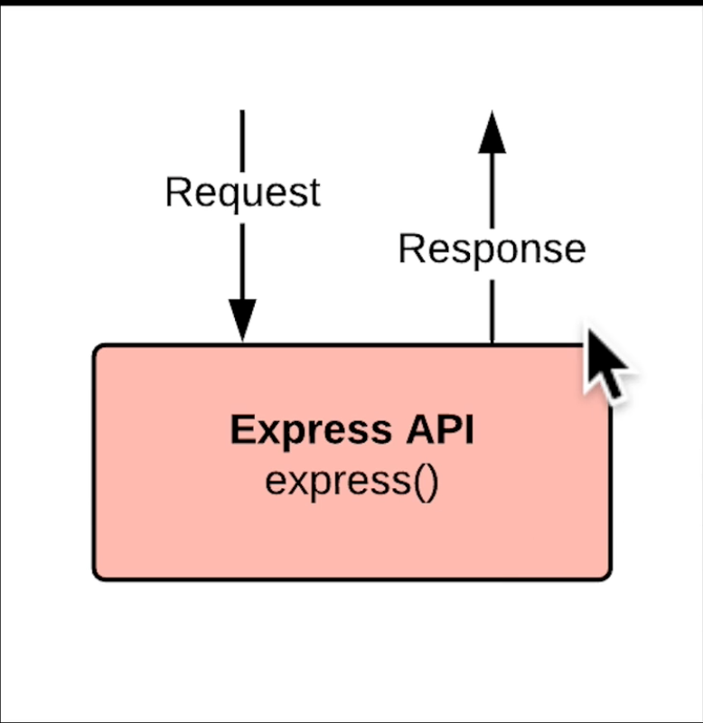

With Middleware  

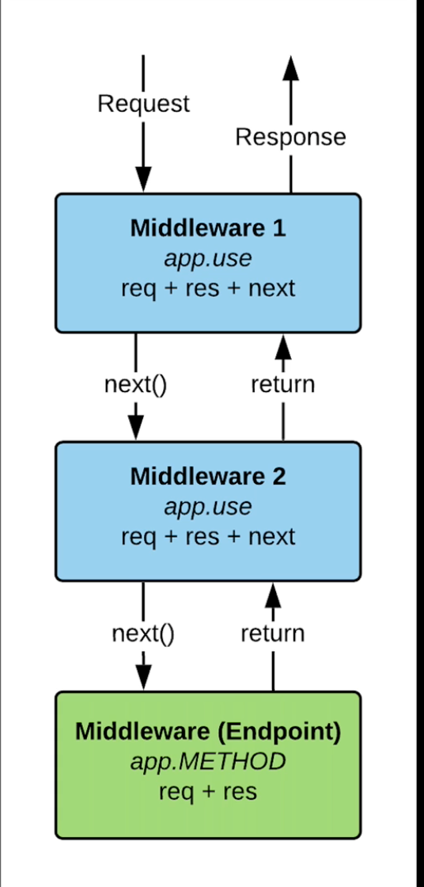

**Code Examples**  
Check "23-hello-expressjs" application.

**Built-in middleware**  

Express has the following built-in middleware functions:  

- [express.static](https://expressjs.com/en/5x/api.html#express.static) serves static assets such as HTML files, images, and so on.
- [express.json](https://expressjs.com/en/5x/api.html#express.json) parses incoming requests with JSON payloads. NOTE: Available with Express 4.16.0+
- [express.urlencoded](https://expressjs.com/en/5x/api.html#express.urlencoded) parses incoming requests with URL-encoded payloads. NOTE: Available with Express 4.16.0+

References  
[Writing middleware for use in Express apps](https://expressjs.com/en/guide/writing-middleware.html)

---

## #92 MVC (Model View Controller)

MVC Pattern  
")

**Code Examples**  
Check "23-hello-expressjs" application.

---

## #94 Express Routers

**Code Examples**  
Check "23-hello-expressjs" application.

---

## #95 RESTful APIs

**RESTful APIs**  

REST is an acronym for:  
REpresentational
State
Transfer

General ideas for the RESTful APIs:  

- Use existing standards (HTTP, JSON, URL)
- Endpoints are collections of data
- Use GET, POST, PUT & DELETE HTTP verbs
- Make sense for the Client - Server architecture
- Requests are stateless and cacheable

---

## #96 CRUD (Create Read Update Delete)

References  
[REST Quick Tips](https://restapitutorial.com/introduction/restquicktips)

---

## #97 Sending Files

**Code Examples**  
Check "23-hello-expressjs" application.

---

## #98 Serving Websites with Node.js

For serving static files or contents we should use CDN like AWS CloudFront.
They are the best for this job.

---

## #107 API Server Setup

Need to revisit this setup code.
Not fully understand it.

Express is just a fancy listener function for our built-in Node.js HTTP server.

That is why server setup in "ztm-nasa-project" application is possible.

Benefits of using this approach

- handle HTTP requests
- use web sockets for real time communication

This is a structure that we can use for any scale of node application.

**Code Examples**  
Check "ztm-nasa-project" application.

---

## #108 Environment Variables On Windows

References  
[cross-env](https://www.npmjs.com/package/cross-env)

---

## #110 CORS Middleware

URL origin includes protocol, hostname and port.
Origin = Protocol + Hostname + Port

References  
[CORS Middleware Package](https://www.npmjs.com/package/cors)

**Code Examples**  
Check "ztm-nasa-project" application.

---

## #111 Models vs Controllers vs Routers

As in "ztm-nasa-project" application,
why it is a good idea to keep models separate from routers and controllers?

It is good to have related code together, that is why we keep routers and controllers together.
Because there is always a controller for a router for sure.

Routers <=> Controllers
Many to One

Generally each router will have its own unique controller.
In case of RESTful APIs we will have multiple resources routes handled by one Resource controller.

Models <=> Controllers
Many to Many

But for our models,
we might have multiple models used in one controller.
OR
A model can be used in multiple controllers as well.

---

Pre-Flight request??


