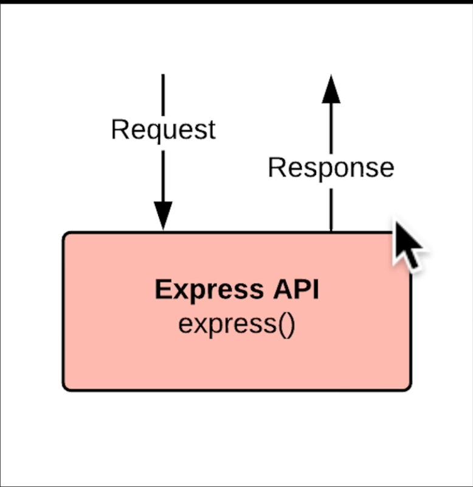
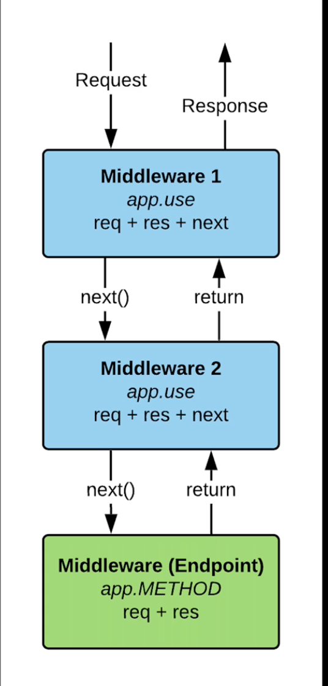

# Complete Node.js Developer by ZTM Udemy

**Index**

1. [Section 1: Introduction](./1784528248726.md)
2. [Section 2: Node.js Fundamentals: Foundations and Environment Setup](./1784528817835.md)
3. [Section 3: Node.js Fundamentals: Internals](./1784529764551.md)
4. [Appendix: How JavaScript Works](./1784541960477.md)
5. [Appendix: Asynchronous JavaScript](./1784549020530.md)
6. [Section 4: Node.js Fundamentals: Module System](./1784554385750.md)
7. [Section 5: Node.js Fundamentals: Package Management](./1784613835867.md)
8. [Section 6: Node.js File I/O - Planets Project](./1784630445576.md)
9. [Section 7: Web Servers with Node.js](./1784702609137.md)

---

## #84 Introduction to Express

**Code Examples**  
Check "23-hello-expressjs" application.

---

## #86 Route Parameters

**Code Examples**  
Check "23-hello-expressjs" application.

---

## #88 Development Dependencies

**Code Examples**  
Check "23-hello-expressjs" application.

---

## #89 Middleware

Without Middleware  

With Middleware  

**Code Examples**  
Check "23-hello-expressjs" application.

**Built-in middleware**  

Express has the following built-in middleware functions:  

- [express.static](https://expressjs.com/en/5x/api.html#express.static) serves static assets such as HTML files, images, and so on.
- [express.json](https://expressjs.com/en/5x/api.html#express.json) parses incoming requests with JSON payloads. NOTE: Available with Express 4.16.0+
- [express.urlencoded](https://expressjs.com/en/5x/api.html#express.urlencoded) parses incoming requests with URL-encoded payloads. NOTE: Available with Express 4.16.0+

References  
[Writing middleware for use in Express apps](https://expressjs.com/en/guide/writing-middleware.html)

---

## #92 MVC (Model View Controller)

MVC Pattern  
")

**Code Examples**  
Check "23-hello-expressjs" application.

---

## #94 Express Routers

**Code Examples**  
Check "23-hello-expressjs" application.

---

## #95 RESTful APIs

**RESTful APIs**  

REST is an acronym for:  
REpresentational
State
Transfer

General ideas for the RESTful APIs:  

- Use existing standards (HTTP, JSON, URL)
- Endpoints are collections of data
- Use GET, POST, PUT & DELETE HTTP verbs
- Make sense for the Client - Server architecture
- Requests are stateless and cacheable

---

## #96 CRUD (Create Read Update Delete)

References  
[REST Quick Tips](https://restapitutorial.com/introduction/restquicktips)

---

## #97 Sending Files

**Code Examples**  
Check "23-hello-expressjs" application.

---

## #98 Serving Websites with Node.js

For serving static files or contents we should use CDN like AWS CloudFront.
They are the best for this job.

---

## #107 API Server Setup

Need to revisit this setup code.
Not fully understand it.

Express is just a fancy listener function for our built-in Node.js HTTP server.

That is why server setup in "ztm-nasa-project" application is possible.

Benefits of using this approach

- handle HTTP requests
- use web sockets for real time communication

This is a structure that we can use for any scale of node application.

**Code Examples**  
Check "ztm-nasa-project" application.

---

## #108 Environment Variables On Windows

References  
[cross-env](https://www.npmjs.com/package/cross-env)

---

## #110 CORS Middleware

URL origin includes protocol, hostname and port.
Origin = Protocol + Hostname + Port

References  
[CORS Middleware Package](https://www.npmjs.com/package/cors)

**Code Examples**  
Check "ztm-nasa-project" application.

---

## #111 Models vs Controllers vs Routers

As in "ztm-nasa-project" application,
why it is a good idea to keep models separate from routers and controllers?

It is good to have related code together, that is why we keep routers and controllers together.
Because there is always a controller for a router for sure.

Routers <=> Controllers
Many to One

Generally each router will have its own unique controller.
In case of RESTful APIs we will have multiple resources routes handled by one Resource controller.

Models <=> Controllers
Many to Many

But for our models,
we might have multiple models used in one controller.
OR
A model can be used in multiple controllers as well.

---

Pre-Flight request??

